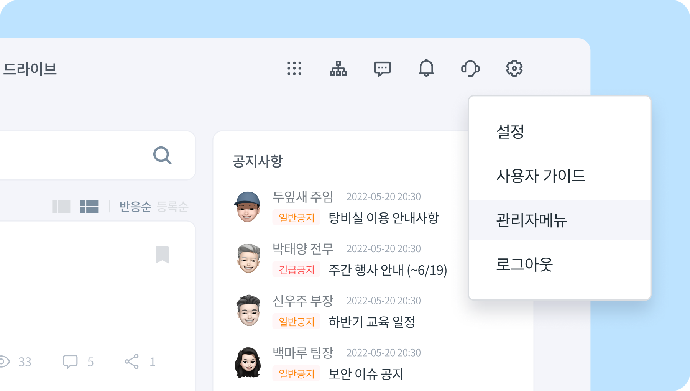
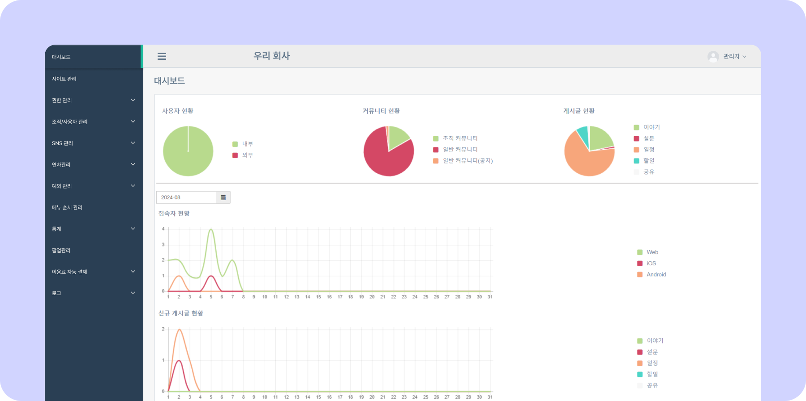

# 관리자메뉴 알아보기

## 관리자메뉴 접속하기

티그리스 메인화면 오른쪽 상단 **[설정 아이콘(⚙️)] - [관리자메뉴]** 를 클릭하세요.

## 관리자 메뉴 페이지 알아보기

### 왼쪽 메뉴

- **[대시보드](../dashboard/dashboard.md):** 사용자, 커뮤니티, 게시글 등의 사용량과 일자별 접속량, 게시글 현황 등 통계 정보를 한눈에 확인할 수 있습니다.
- **[사이트 관리](../site/configuration.md):** 회사의 상세정보 확인과 부서비스 동기화를 할 수 있습니다.
- **[권한 관리](../auth/role.md):** 사용자에게 관리자메뉴의 접근 권한을 부여합니다.
    - **권한 그룹/멤버/롤 관리:** 그룹별로 접근권한을 제어합니다.
- **조직/사용자 관리:** 회사에 구성된 조직,사용자를 설정,변경 할 수 있습니다.
    - **[조직 관리](../organization/overview.md):** 조직도를 수정 및 관리할 수 있습니다
    - **[사용자 관리](../organization/set-members.md):** 사용자를 추가/삭제할 수 있습니다.
    - **[겸직 관리](../organization/concurrent-position.md):** 사용자를 겸직으로 설정할  수 있습니다.
    - **[일괄 등록(조직,사용자)](../organization/bulk-add-member.md):** 조직,사용자를 일괄 등록할 수 있습니다
    - **[정렬 관리](../organization/sort-position.md):** 조직도에서 직원의 정렬 순서를 직책/직원 순으로 설정할 수 있습니다.
- **SNS 관리:** 커뮤니티에 관련된 내용을 관리할 수 있습니다.
    - **[커뮤니티 관리](../sns/community.md):** 생성된 커뮤니티를 조회 및 관리할 수 있습니다.
    - **[게시물 관리](../sns/posts.md):** 작성된 게시물을 조회 및 관리할 수 있습니다.
    - **[신고 내역 관리](../sns/accusation.md):** 신고된 부적절 게시물을 확인할 수 있습니다.
    - **[위젯 링크 관리](../sns/widget.md):** 티그리스 우측메뉴의 위젯 링크를 수정할 수 있습니다.
- **연차관리:** 조직원의 휴가 일 수를 등록하고 내역을 조회할 수 있습니다.
    - **[연차 정보 관리](../annual-leave/management.md):** 연차 정보를 등록 및 관리할 수 있습니다.
    - **[연차 내역 조회](../annual-leave/history.md):**  연차 내역을 조회할 수 있습니다.
- **예외 관리:** 사용 권한과 이메일 사용을 관리할 수 있습니다.
    - **[WORKS 접근 제어](../exception/access-control.md):** 전자결재, 이메일 사용권한을 관리합니다.
    - **[이메일 사용 관리(외부사용자)](../exception/external-user.md):** 외부사용자의 이메일 사용을 관리합니다.
- **[메뉴 순서 관리](../menu/change-order.md):** 티그리스 상단 메뉴를 원하는데로 변경할 수 있습니다.
- **[통계](../statistics/history.md):** 통계 정보를 상세하게 조회할 수 있습니다.
    - **접속자 현황:** 접속자에 대한 정보를 확인할 수 있습니다.
    - **사용자 통계:** 사용자별 사이트 이용 통계를 알 수 있습니다
- **[팝업 관리](../popup/add.md):** 티그리스 사이트에 팝업창을 띄우고, 관리할 수 있습니다.
- **이용료 자동 결제:** 티그리스 사용료를 자동으로 결제할 수 있게 관리 합니다.
    - 결제 수단 관리:  카드 또는 계좌를 등록할 수 있습니다.
    - 자동 결제 내역: 결제한 내역을 확인할 수 있습니다.
- **로그:** 매 월 사용자들의 접속 현황을 확인할 수 있습니다.
    - 로그인 로그: 월, 기기, 결과로 구분하여 조회할 수 있습니다.