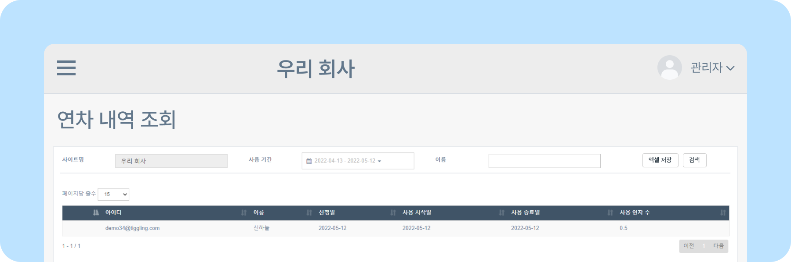
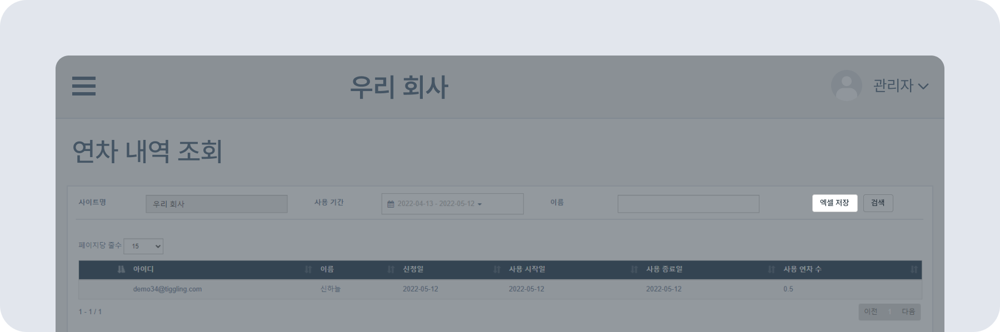

# 연차 내역 조회하기

## 연차 내역 조회하기

- 뉴스피드 오른쪽 상단 [**설정 아이콘**(⚙️)] **- [관리자메뉴] - 연차관리 - 연차 내역 조회**를 클릭하세요.
- **사용 기간** 또는 **사용자 이름**을 **검색**해 특정 기간이나 특정 사용자의 연차 사용 내역을 조회할 수 있습니다.
    
- **[엑셀 저장]** 버튼을 통해 연차 내역을 엑셀 파일로 저장할 수 있습니다.
    