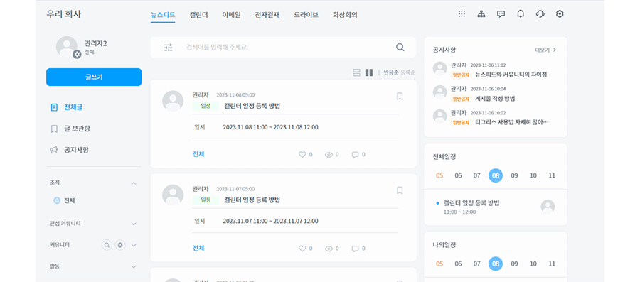
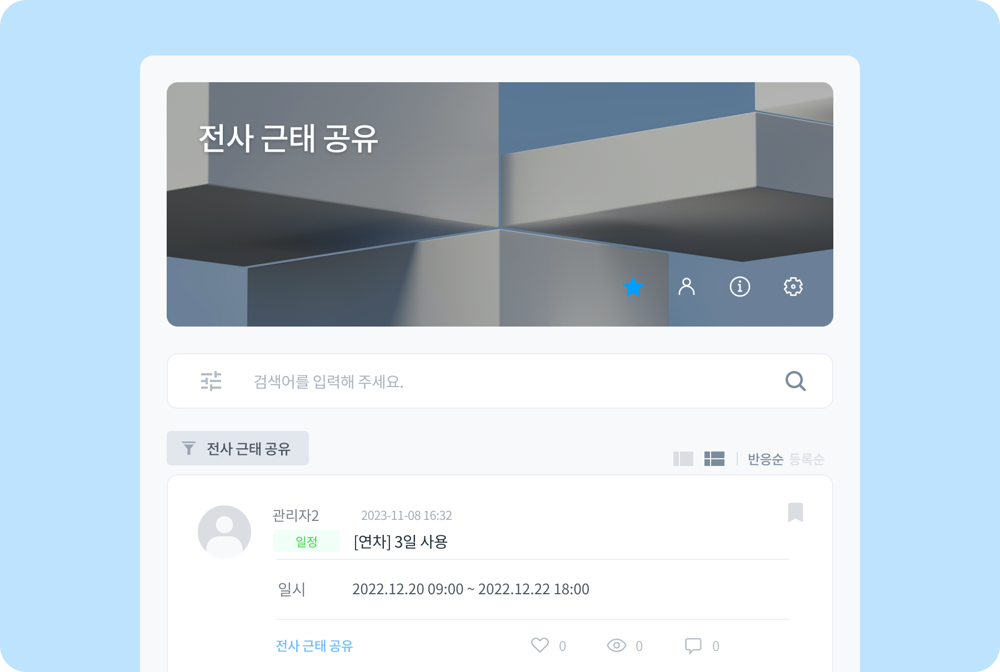

# 연차-커뮤니티 연동하기

## 연차-커뮤니티 연동하기

- 뉴스피드 오른쪽 상단 **[설정 아이콘(⚙️)] - 설정 - 연차휴가 커뮤니티 - 연차사용여부 'off->on 변경' - 연차 연동할 커뮤니티 선택** 하면 연차 승인되면 자동으로 등록되게 연동할 수 있습니다.  
    (**근태를 공유할 커뮤니티를 신규 생성**해주어야 휴가 일정을 등록 할 수 있습니다.)
- 연차 휴가원(전자결재) 승인이 나면 커뮤니티에 휴가 일정이 자동으로 등록 됩니다.
    
    
    > 휴가 종류와 날짜가 승인이 나면 일정으로 자동으로 등록 됩니다.