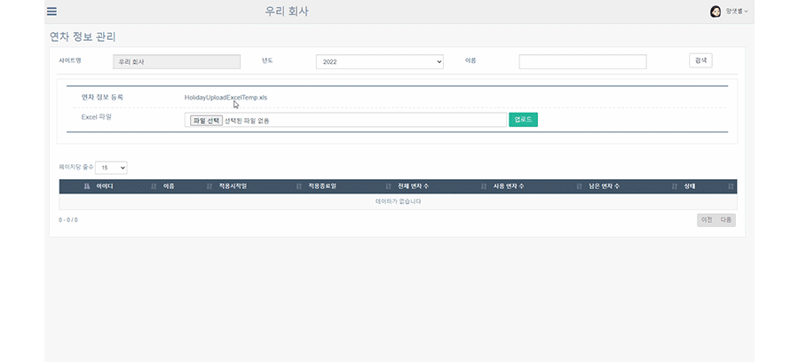
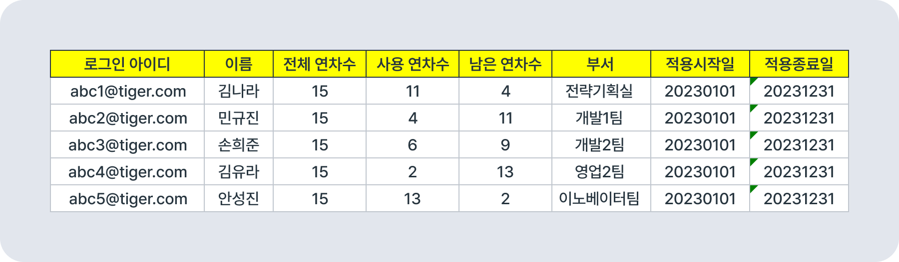
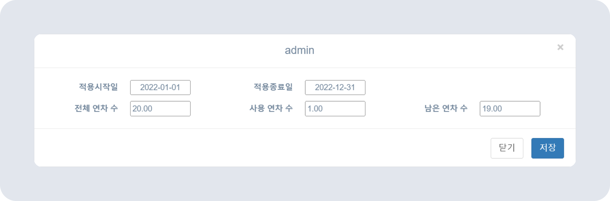

# 연차 정보 등록/수정/확인하기

> 📅 사용자가 전자결재에서 연차를 사용하고 조회하는 방법은 [연차휴가 작성하기](#)를 참고하세요.

## 연차 정보 등록하기

- 연차 정보를 등록하여 **전자결재와 동기화**해 연차를 사용할 수 있습니다.
- 뉴스피드 오른쪽 상단 **[설정 아이콘(⚙️)] - [관리자메뉴] - 연차 관리 - 연차 정보 관리**에서 연차 정보를 등록하고, 구성원의 연차 정보를 변경할 수 있습니다.
- *HolidayUploadExcelTemp.xls* 파일을 다운로드해 양식에 맞게 연차 정보를 작성하고 업로드하세요.
- 연차정보 업로드가 완료되면 전자결재와 동기화해 사용할 수 있습니다.
    
    
    > 현재까지 사용한 연차 일수를 그대로 입력해주시면 됩니다. 적용시작일은 0101(1월 1일), 적용종료일은 1231(12월 31일)로 기록해주세요.
    - ✔️ 연차 이용시 중도입사자는 **만근 시 지급되는 월차를 처음부터 전체 부여**해주는 것이 관리가 용이합니다.  
    (월차를 매달 하나씩 부여할 시, 매달 연차 정보를 수정해주셔야 합니다.)

## 연차 정보 수정하기

- 등록된 연차 정보를 수정할 수 있습니다
- 신청한 연차를 사용하지 못한 경우 수동으로 수정할 수 있습니다. 적용일자에 맞는 연차만 사용이 가능하니 주의하세요.
    