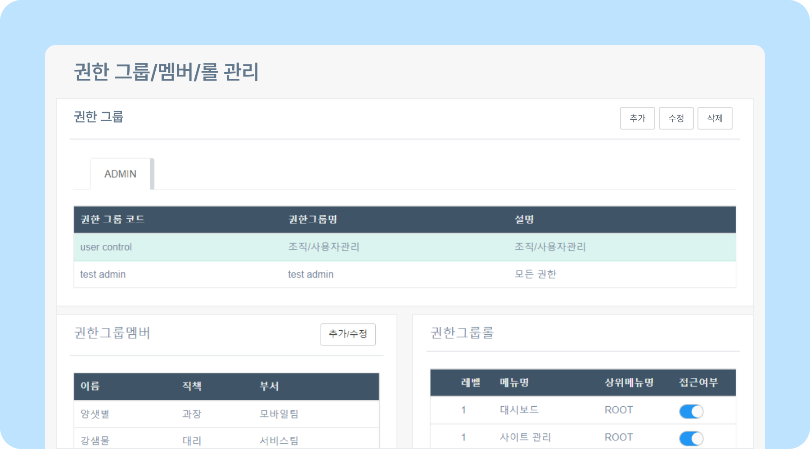
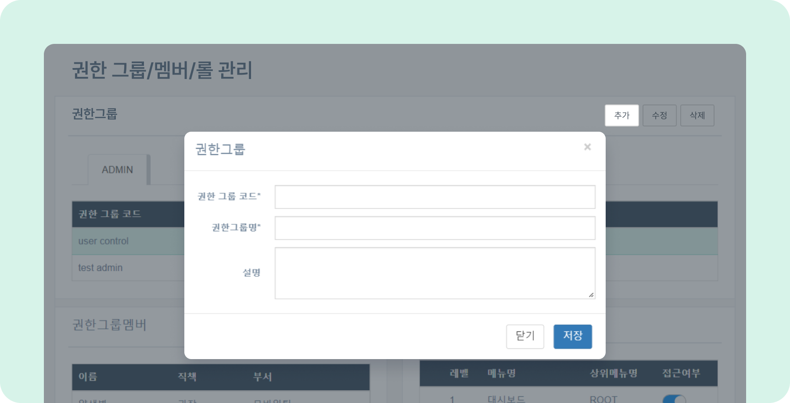
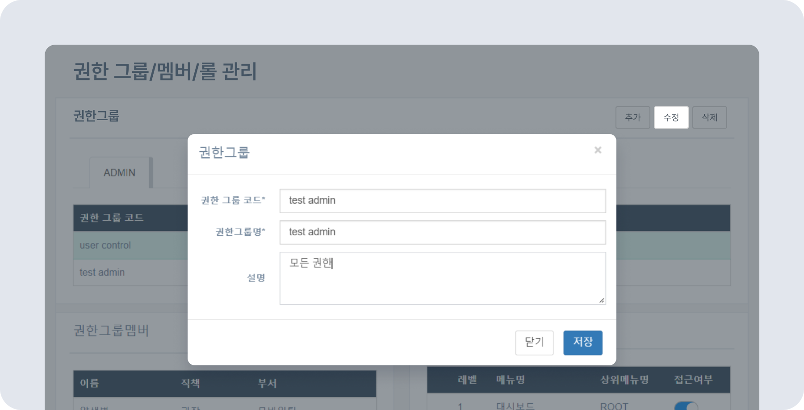
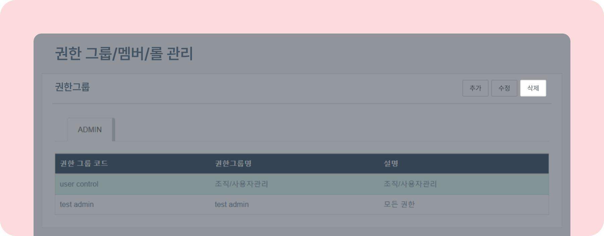
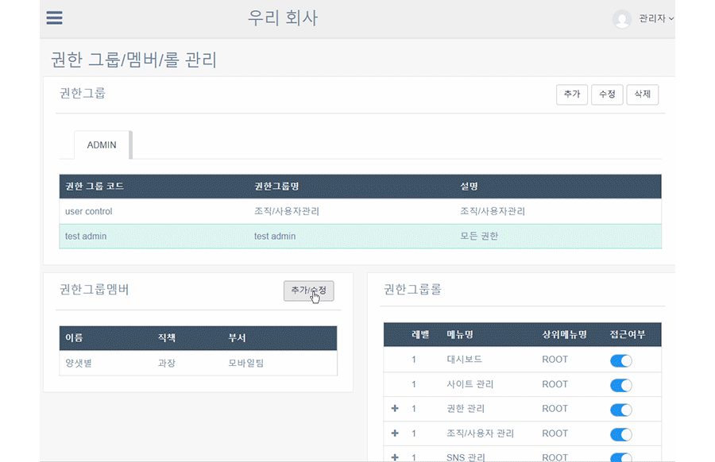
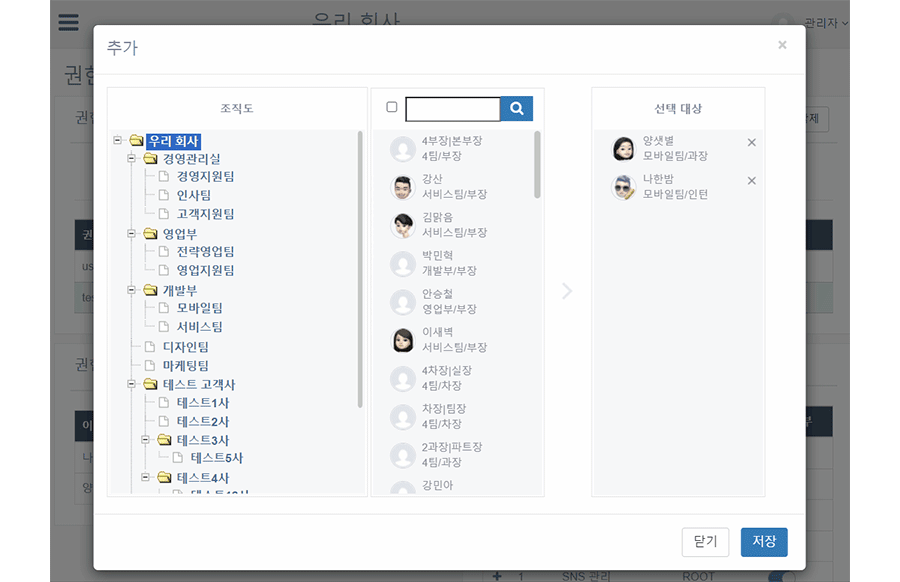
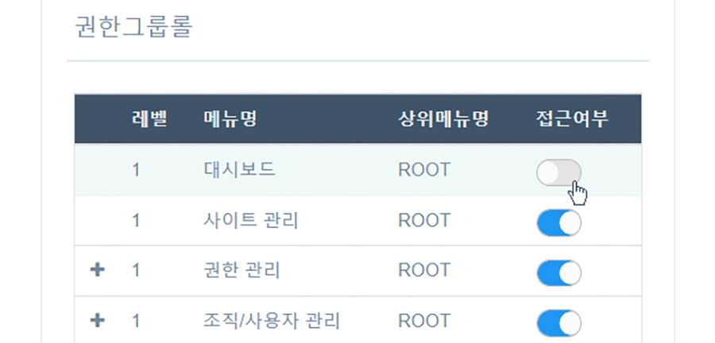

# 권한 그룹/멤버/롤 관리하기

## 권한 관리

- 권한 그룹과 멤버를 추가/수정/삭제하여 그룹의 롤(권한) 범위를 수정할 수 있습니다.
- 뉴스피드 오른쪽 상단 **[설정 아이콘(⚙️)] - [관리자 메뉴] - 권한 관리 - 권한 그룹/멤버/롤 관리** 를 클릭하세요.
    

### 권한 그룹 추가

- 오른쪽 상단의 **[추가]** 버튼 클릭 - 추가할 **권한 그룹 코드, 권한 그룹명, 설명** 을 작성한 후  **[저장]** 버튼을 클릭하세요.
    

### 권한 그룹 수정

- 오른쪽 상단의 **[수정]** 버튼 클릭 - 수정할 **권한 그룹 코드, 권한 그룹명, 설명** 을 작성한 후  **[저장]** 버튼을 클릭하세요.
    

### 권한 그룹 삭제

- 오른쪽 상단의 **[삭제]** 버튼 - 삭제할 그룹 코드 선택 -  **[삭제]** - **[확인]** 버튼을 클릭하세요.
    

### 권한 그룹 멤버 추가

- **[추가/수정]** 버튼 클릭 - 추가할 멤버 선택 - **[>]** - **[저장]** 버튼을 클릭해 권한 그룹에 멤버를 추가하세요.
    

### 권한 그룹 멤버 삭제

- **[삭제]** 버튼 - 삭제할 멤버를 선택 - **[X]** 아이콘을 클릭해 삭제 - **[저장]** 버튼을 클릭하세요.
    

### 권한 롤 관리

- 접근 권한 정도에 따라 그룹의 롤을 조정할 수 있습니다. 허용할 권한은 **접근여부** 항목의 토글을 클릭해 활성화하세요.
    
