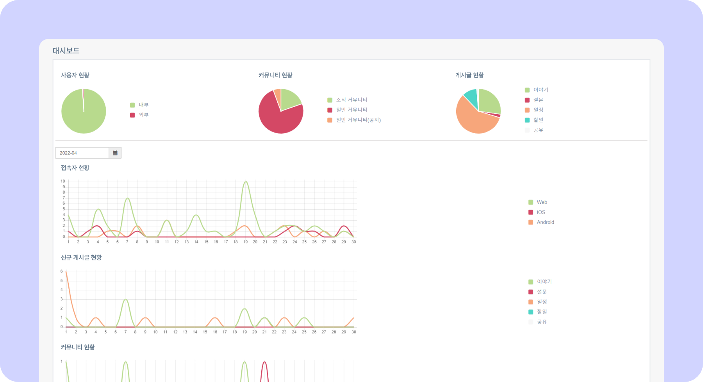
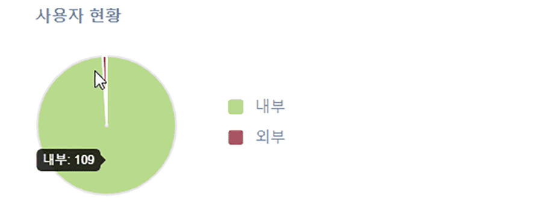
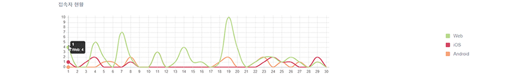
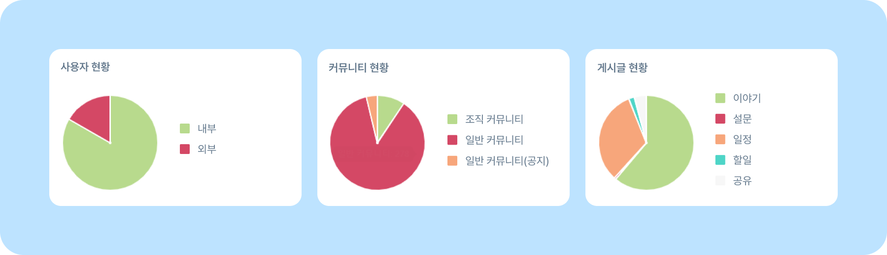
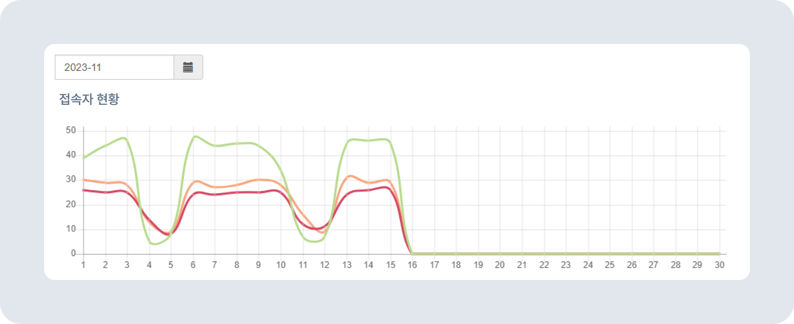
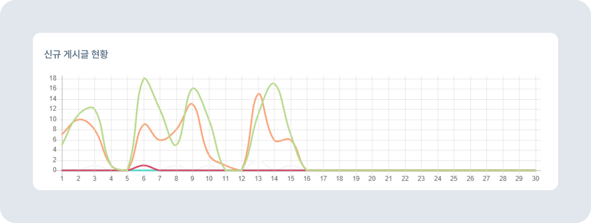
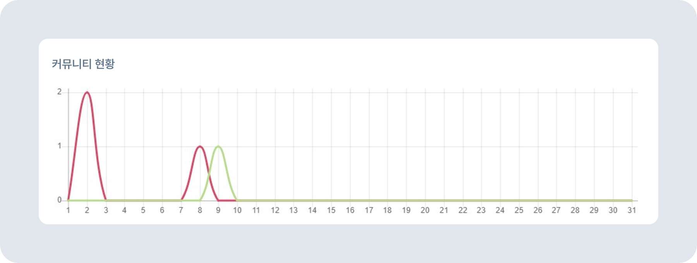

# 사이트 통계(대시보드) 확인하기

## 대시보드

* 대시보드에서는 사용자, 커뮤니티, 게시글 현황과 접속자 기기, 커뮤니티에 관한 통계 정보를 한눈에 확인할 수 있습니다

* 마우스 커서를 도표 위로 올리면 통계 내용을 확인할 수 있습니다.

## 통계 내용

* **사용자 현황:** 조직 내의 사용자인 내부사용자와 조직도에 포함되지 않는 외부사용자 의 수를 확인할 수 있습니다.
* **커뮤니티 현황:** 현재 활성화된 커뮤니티의 수가 조직 커뮤니티, 일반 커뮤니티, 공지 커뮤니티 로 분류되어 나타납니다. 
* **게시글 현황:** 누적된 게시글의 숫자를 확인할 수 있습니다. 이야기, 설문, 일정, 할일, 공유 게시글 중 구성원들이 어떤 게시글을 가장 많이 활용하고 있는지 분석이 가능합니다.

### 접속자 현황

- 왼쪽 위의 날짜 설정 탭에서 확인하고자 하는 달(月)을 선택합니다. 따로 설정하지 않으면 기본 값으로 현재 시점의 달(月)을 표시합니다.
- X축에 표시되는 숫자는 날짜(日)입니다.
- **접속자 현황:** 그래프를 통해 하루(00시 00분~23시 59분 59초) 내 로그인에 성공한 ID의 숫자를 확인할 수 있습니다. 하루 동안 1번도 로그인하지 않거나 로그인에 실패했을 시 해당 ID는 카운트 되지 않습니다.
- 🟩 초록색 그래프는 웹에서 로그인한 ID 수를 나타냅니다.
- 🟥 붉은색 그래프는 iOS(아이폰)에서 로그인한 ID 수를 나타냅니다.
- 🟧 주황색 그래프는 Android(안드로이드 휴대폰)에서 로그인한 ID 수를 나타냅니다.

### 신규 게시글 현황

- X축에 표시되는 숫자는 날짜(日)입니다.
- **신규 게시글 현황:** 그래프는 하루(00시 00분~23시 59분 59초) 내 생성된 게시글의 수를 보여줍니다.
- 🟩 초록색 그래프는 하루 동안 생성된 이야기 게시물의 개수를 나타냅니다.
- 🟥 붉은색 그래프는 하루 동안 생성된 설문 게시물의 개수를 나타냅니다.
- 🟧 주황색 그래프는 하루 동안 생성된 일정 게시물의 개수를 나타냅니다.
- 🟦 민트색 그래프는 하루 동안 생성된 할일 게시물의 개수를 나타냅니다.
- ⬜ 흰색 그래프는 하루 동안 생성된 공유 게시물의 개수를 나타냅니다.

### 커뮤니티 현황

- X축에 표시되는 숫자는 날짜(日)입니다.
- 커뮤니티 현황 그래프를 통해 커뮤니티의 변동을 확인할 수 있습니다. 신규 생성된 커뮤니티의 갯수와 폐쇄된 커뮤니티의 개수를 알 수 있습니다. 그래프의 Y축이 0에서 변동이 없다면, 새롭게 생성되거나 폐쇄된 커뮤니티가 없다는 의미입니다.
- 🟩 초록색 그래프는 하루 동안 생성된 신규 커뮤니티의 개수를 나타냅니다.
- 🟥 붉은색 그래프는 하루 동안 폐쇄된 커뮤니티의 개수를 나타냅니다.