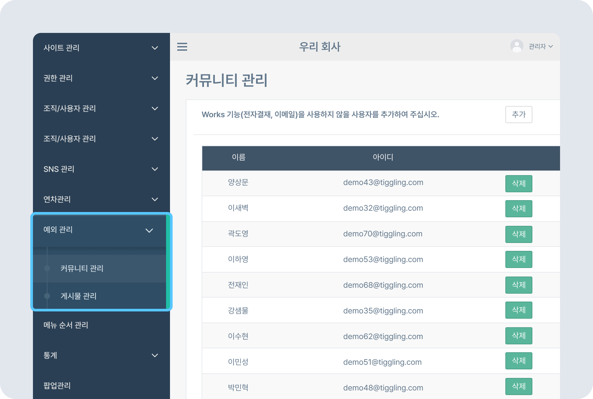

# WORKS 접근제어

## WORKS 접근제어

- 내부 사용자의 이메일 또는 전자결재 시스템 접근 권한을 제한할 수 있습니다.

### WORKS 접근 제어 추가하기

- 뉴스피드 오른쪽 상단 **[설정 아이콘(⚙️)] - [관리자 메뉴] - 예외 관리 - WORKS 접근 제어**를 클릭하세요.
    
- 오른쪽 상단의 **[추가]** 버튼을 클릭 - 추가할 사용자 선택한 후 **[>]** 클릭해 추가 - **[저장]** 버튼을 클릭하세요. 추가한 사용자의 전자결재, 이메일 사용이 제한됩니다.
    

## WORKS 접근 제어 해제하기

- 접근 제어를 해제할 사용자 옆 **[삭제]** 버튼을 클릭한 후 팝업창에서 **[확인]** 을 클릭하세요.
    