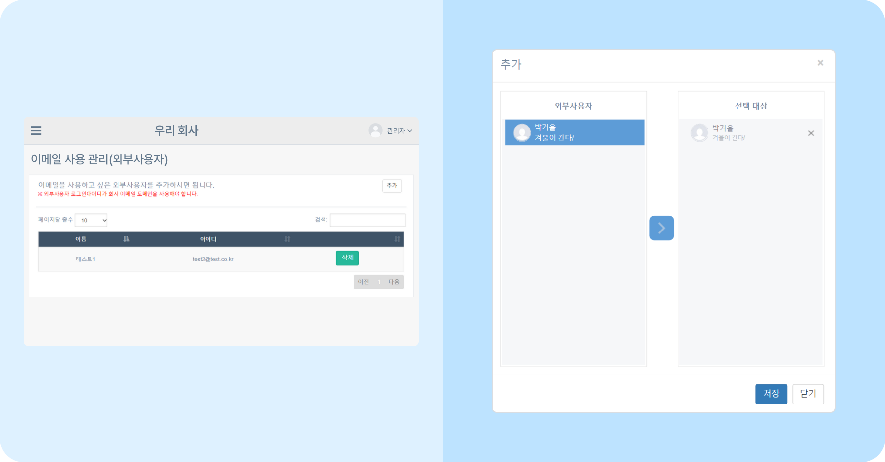
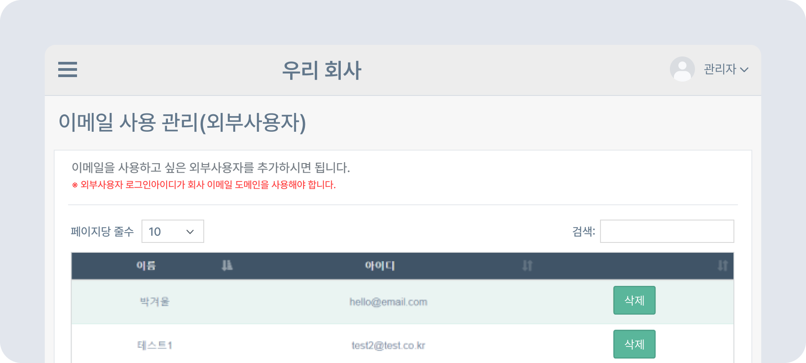

# 외부 사용자 이메일 사용 관리하기

## 외부 사용자 이메일 사용 관리하기

- 이메일을 사용할 외부 사용자를 추가할 수 있습니다.
    > 📩 외부 사용자의 로그인 아이디가 회사 이메일 도메인이어야 합니다. 사이트에 사용자를 추가하는 방법은 [사용자 추가 및 관리](../organization/add-members.md) 를 참고하세요. 이메일 추가 후엔 사이트 관리에서 동기화를 해주셔야 이메일 기능이 적용됩니다.

### 외부 사용자 이메일 추가하기

- 뉴스피드 오른쪽 상단 **[설정 아이콘(⚙️)] - [관리자메뉴] - 예외 관리 - 이메일 사용 관리(외부 사용자)** 를 클릭하세요.
- 오른쪽 상단의 **[추가]** 버튼 - 이메일 권한 부여할 외부 사용자 선택 - **[>]** - **[저장]** 버튼을 클릭하세요.
    

### 외부 사용자 이메일 사용 제한하기

- 삭제할 사용자 옆 **[삭제]** 버튼 - **[확인]** 버튼을 클릭하세요.
    