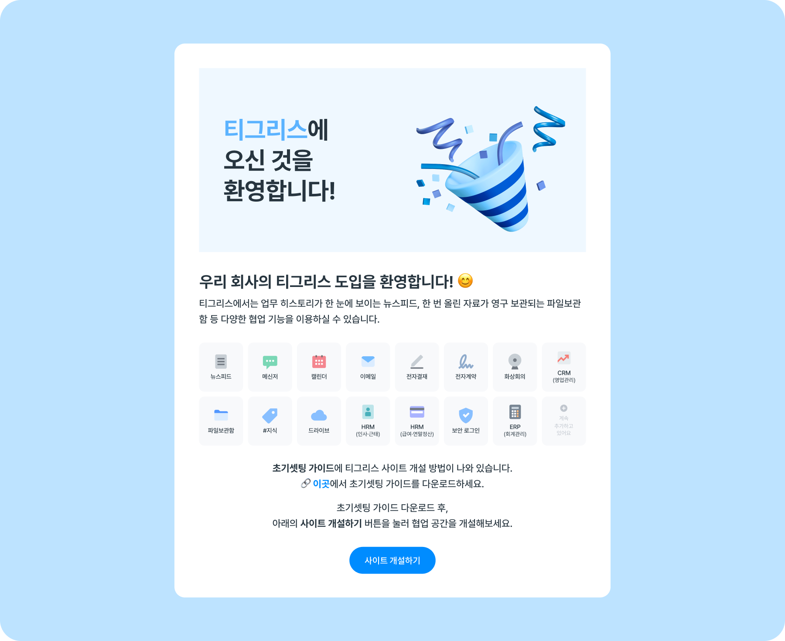
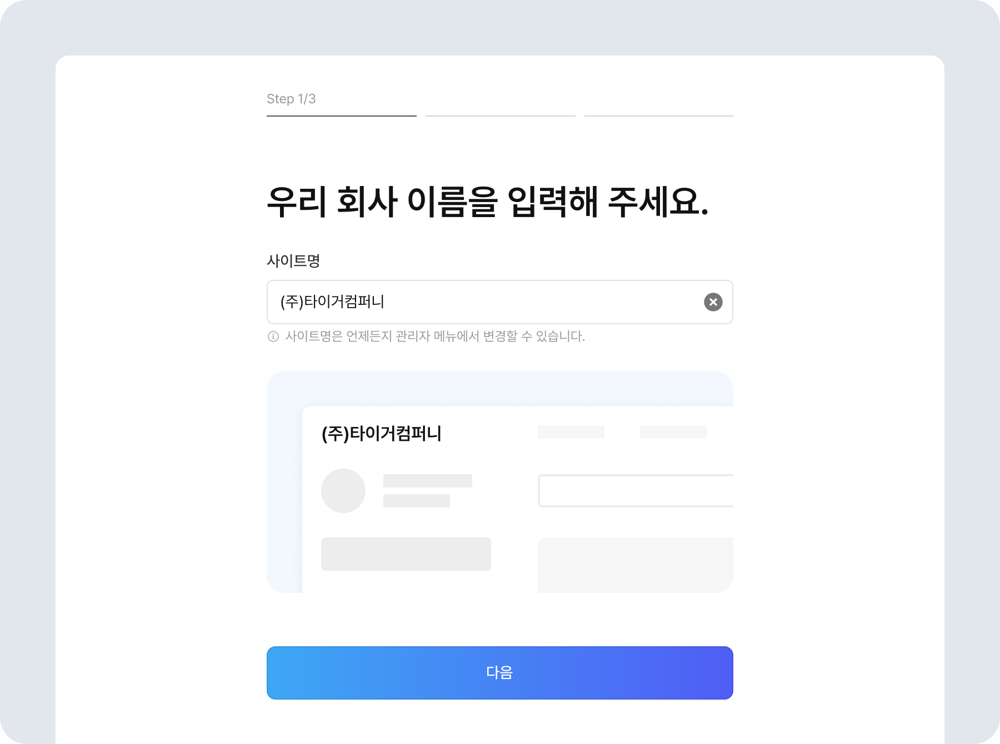
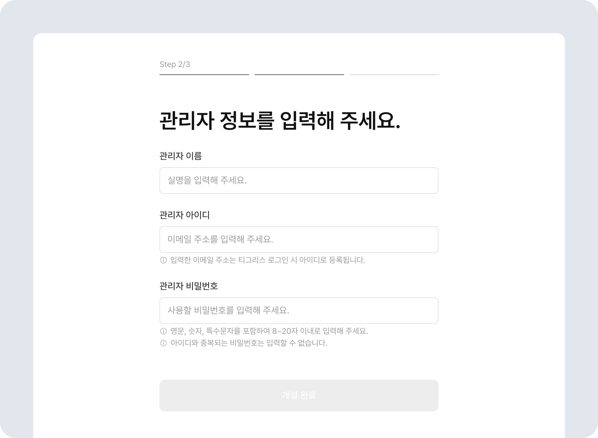

# 우리회사 사이트 오픈하기

## 자가개설 링크로 사이트 오픈하기

1. 메일로 자가개설 링크가 발송되면, 메일 페이지 하단에 있는 **\[사이트 개설하기]** 버튼을 클릭하세요!!

2. **사이트 개설하기** 화면에서 회사면을 입력한 후 **\[다음]** 을 클릭하세요. 입력한 회사명은 티그리스 사이트명으로 사용됩니다. 

3. 우리 회사 사이트를 관리할 **관리자 정보**를 입력한 후 \[개설 완료] 버튼을 클릭하세요. 관리자는 작성한 아이디와 비밀번호로 티그리스에 로그인한 후, 조직을 관리할 수 있습니다. 

4. 협업 공간 생성이 완료되었습니다. 이제 \[관리자 로그인]을 클릭해 사이트 설정을 시작하세요. 관리자는 티그리스 관리자 메뉴에서 조직과 사용자를 추가할 수 있습니다. 조직과 사용자를 쉽게 추가하는 방법은 [조직 및 사용자 일괄 등록하기](./organization/bulk-add-member.md) 페이지를 참고해 주세요. 

5. 사이트 개설이 완료되었습니다.
