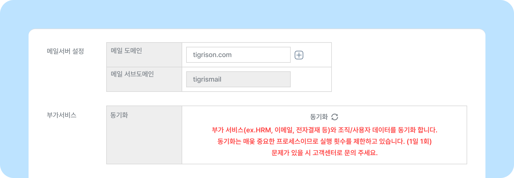
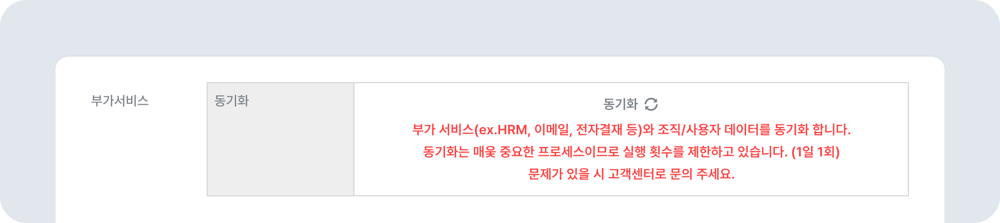

# 이메일 연결하기

## 이메일 사용하기

- **고객사 DNS  설정하기**
    - MX 레코드: SPAM-NLB-bf85e0721378d7fd.elb.ap-northeast-2.amazonaws.com
    - SPF(TXT) 레코드: "v=spf1 include:_spf.sirteam.net ~all”   

- **이메일 도메인 동기화하기**
    - 뉴스피드 오른쪽 상단 **[설정 아이콘(⚙️)] - [관리자메뉴]** - 사이트 관리에서 도메인 정보를 입력한 후 [동기화(🔄)]를 진행하세요.  
      
    ✅ 동기화는 매주 중요한 프로세스이므로 1일 1회로 횟수 제한하고 있습니다.

## 전자결재 사용하기

- 전자결재 메뉴가 오픈되면 전자결재 [동기화(🔄)]를 진행해야 합니다.  

- 뉴스피드 오른쪽 상단 **[설정 아이콘(⚙️)] - [관리자메뉴]** - 사이트 관리에서 동기화를 진행하면 됩니다.
- 동기화 진행 후 결재 양식은 매일 오후 12시, 21시에 일괄적으로 생성됩니다.