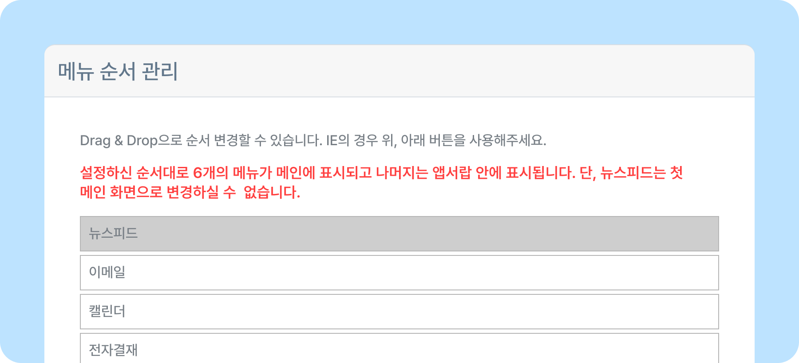
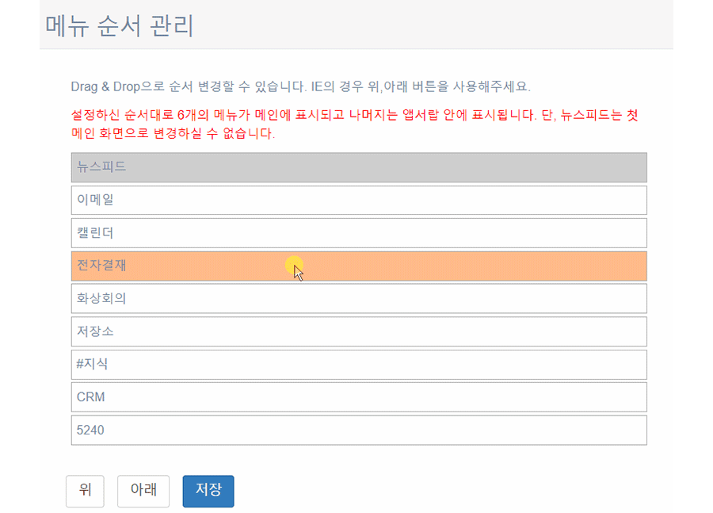

# 상단 메인 메뉴 순서 변경하기

## 메뉴 순서 관리하기

- 사용하고 있는 상단 메인 메뉴를 원하는 대로 배치할 수 있습니다.
- 뉴스피드는 변경할 수 없습니다.
- 뉴스피드 오른쪽 상단 **[설정 아이콘(⚙️)] - [관리자메뉴] - 메뉴 순서 관리**를 클릭하세요.
    
- 마우스 드래그 앤 드롭 또는 **[위]**, **[아래]** 버튼으로 메뉴 순서를 변경할 수 있습니다.
    