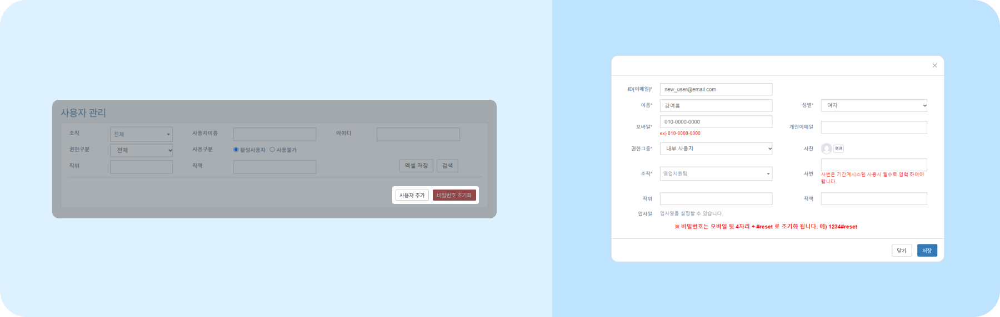
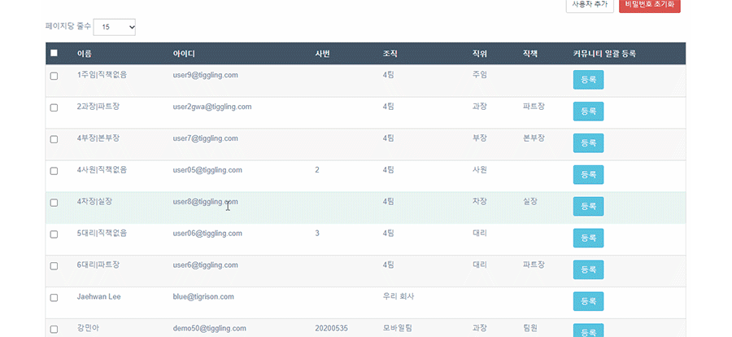
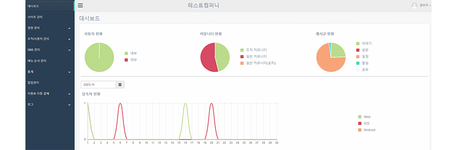
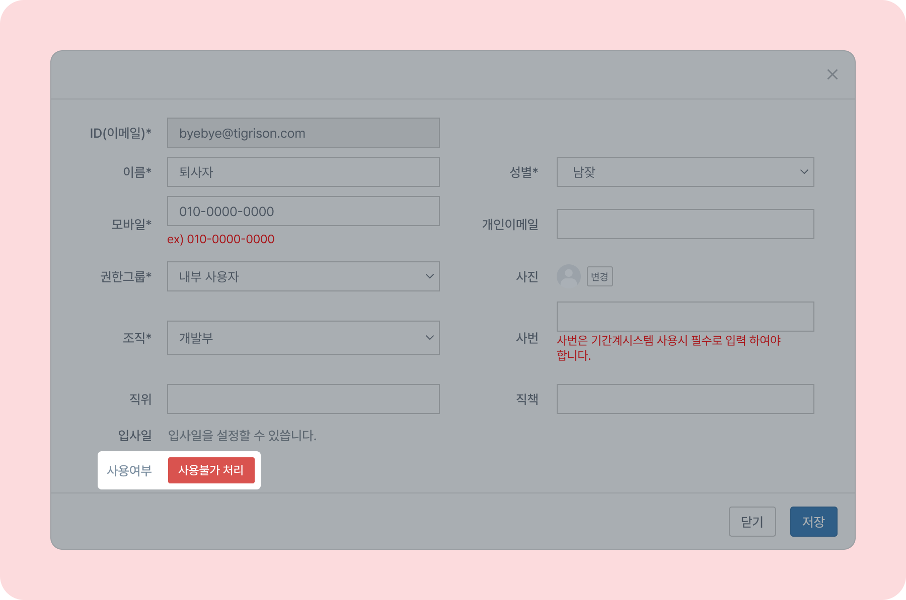
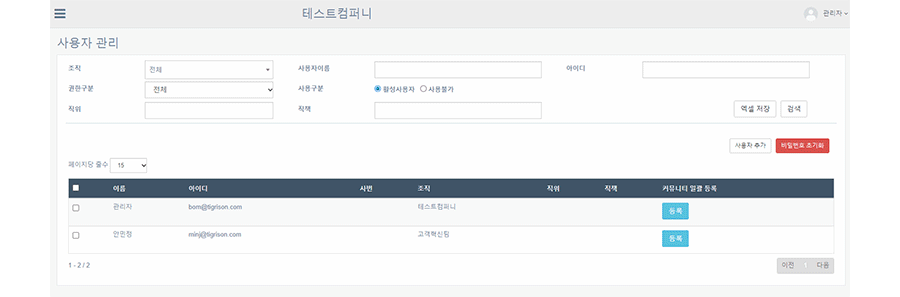
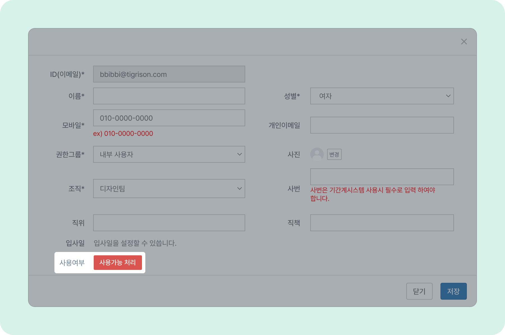
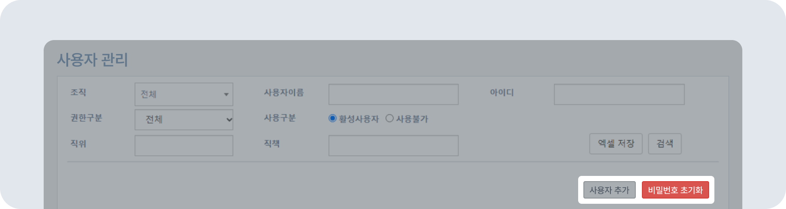

# 사용자 추가 및 관리

## 사용자 추가

- 신규 입사자가 발생할 경우 사용자 추가를 통해 티그리스 아이디를 생성할 수 있습니다.
- 뉴스피드 오른쪽 상단 **[설정 아이콘(⚙️)] - [관리자메뉴] - [조직/사용자관리] - 사용자 관리** 로 접속합니다.
- 오른쪽 하단의 **[사용자 추가]** 버튼을 누르고 **사용자 정보 작성 - [저장]** 버튼을 클릭하세요.
    
- 처음 생성되는 사용자의 비밀번호는 **휴대전화 번호 뒤 4자리+#reset** 입니다.
- 외부사용자 추가가 필요할 시 티그리스 고객센터로 문의해 주세요.

## 사용자 정보 변경

- 정보변경을 원하는 사용자를 클릭한 뒤 정보를 변경하고 [저장]을 눌러주세요.
    

## 사용불가 처리

- 퇴사자가 발생하면 해당 사용자의 아이디를 사용불가 처리해주세요
- 사용불가를 원하는 사용자를 클릭한 뒤 **[사용불가 처리]** 버튼을 클릭하세요.
- 사용불가 처리를 하게 되면 해당 아이디로 로그인이 불가능합니다.
- 사용불가 처리가 완료된 사용자는 사용구분 의 사용불가 를 선택 후 검색 버튼 클릭하여 확인할 수 있습니다.

## 사용가능 처리

- 퇴사한 직원의 데이터를 확인하거나 재 입사를 할 경우에는 **사용자 관리  - 사용구분 - 사용불가 - 사용자 클릭 - 사용가능 처리** 를 해주시면  
활성 사용자로 변경됩니다.

## 비밀번호 초기화

- 비밀번호 초기화를 원하는 사용자를 클릭한 뒤  **[비밀번호 초기화]** 를 눌러주세요. 사용자의 비밀번호는 **휴대전화 번호 뒤 4자리+#reset** 으로 초기화됩니다. **(ex.0000#reset)**
    