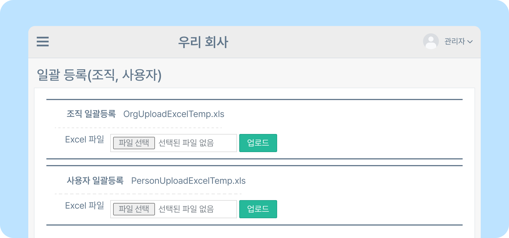
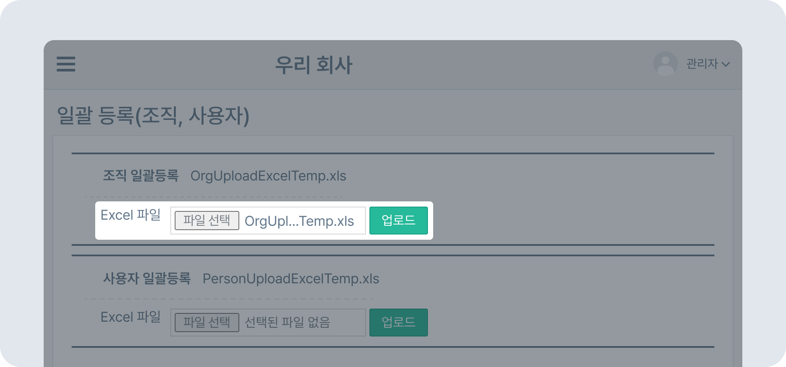
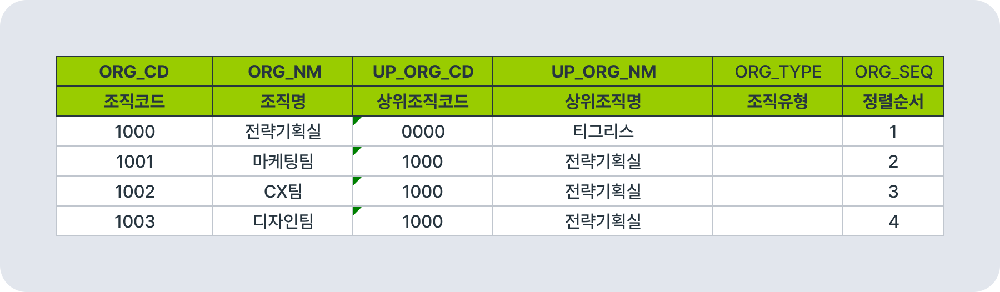
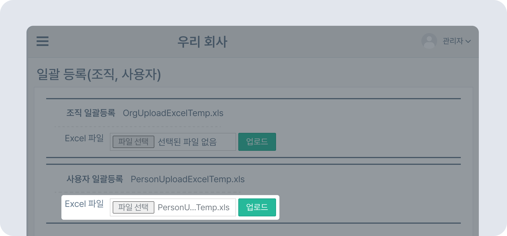
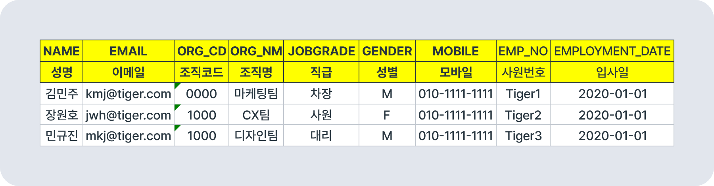

# 조직 및 사용자 일괄 등록하기

## 조직 및 사용자 일괄 등록하기

- 뉴스피드 오른쪽 상단 **[설정 아이콘(⚙️)] - [관리자메뉴] - 조직/사용자관리 - 일괄 등록(조직,사용자)** 으로 이동하세요.
    

## 조직 일괄등록

- **OrgUploadExcelTemp.xml**  파일을 다운로드해 양식에 맞게 조직 정보를 작성한 후 업로드하세요.
- **반드시 2개 이상의 조직을 등록하세요.**
    
    
    > 조직명과 상위조직명을 구분해서 작성해야 합니다.

## 사용자 일괄등록

- **PersonUploadExcelTemp.xls** 파일을 다운로드해 양식에 맞게 사용자 정보를 작성한 후 업로드하세요.
- **조직을 먼저 등록한 후 사용자를 등록하세요.**
    
    
    > 조직 일괄등록에서 등록한 조직코드와 조직명을 정확히 작성해주세요. 조직 등록 후 사용자 등록이 가능합니다.