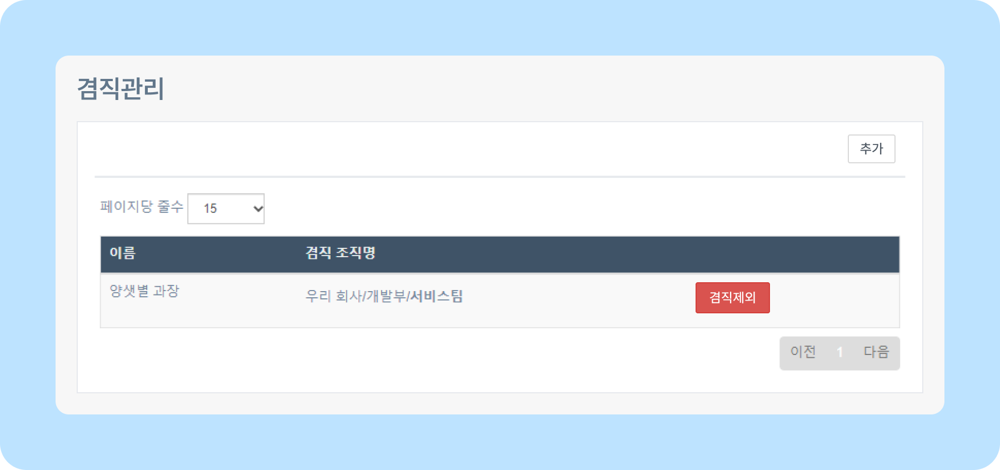
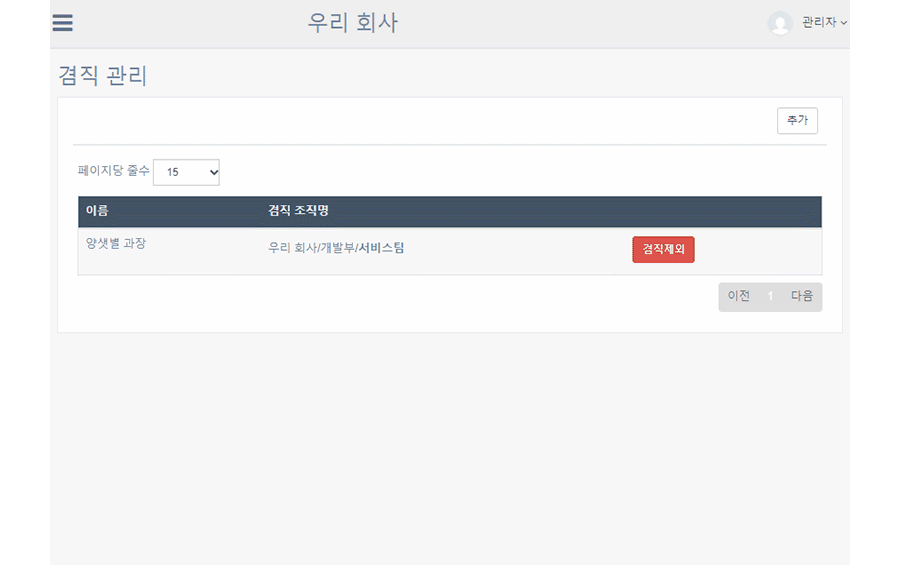
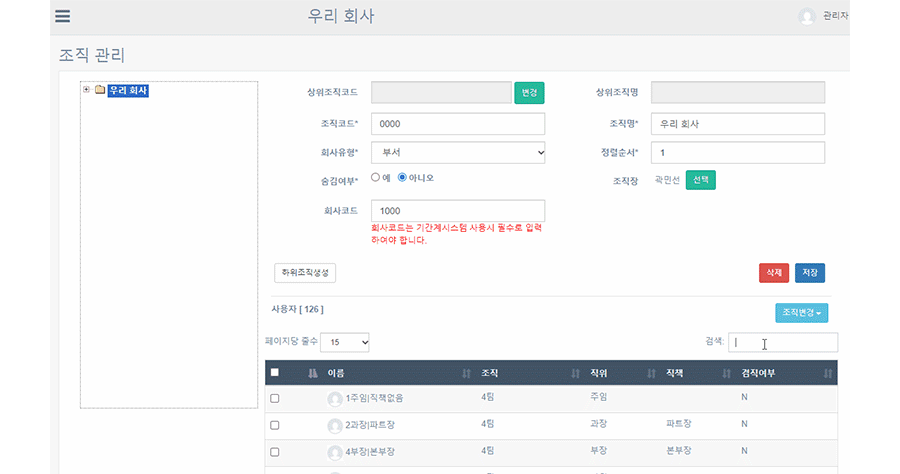
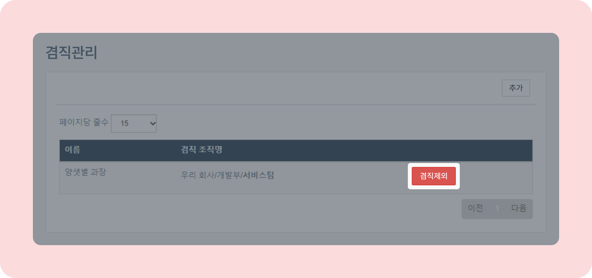
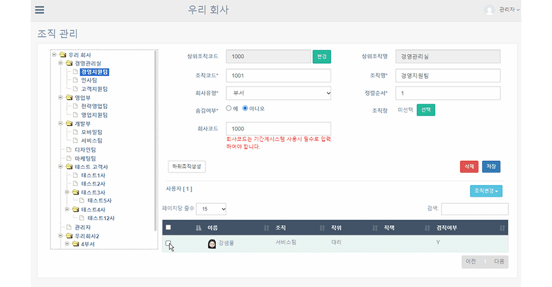

# 사용자 겸직 관리

## 겸직 관리하기

- 뉴스피드 오른쪽 상단 **[설정 아이콘(⚙️)] - [관리자메뉴] - 조직/사용자관리 - [겸직 관리]** 를 클릭하세요.
    

## 사용자 겸직 추가하기

- 뉴스피드 오른쪽 상단 **[설정 아이콘(⚙️)] - [관리자메뉴] - 겸직 관리 - 추가 - 겸직을 원하는 사용자 선택 - 겸직 등록할 조직 선택 - 추가** 버튼을 클릭하세요.
    
- 조직관리에서도 겸직 추가가 가능합니다. 뉴스피드 오른쪽 상단 **[설정 아이콘(⚙️)] - 관리자메뉴 - 조직/사용자관리 - 조직 관리 - 겸직을 원하는 사용자 선택 - 조직변경 - 겸직 - 겸직 등록할 조직 선택 - [추가]** 버튼을 클릭하세요.
    

## 겸직 제외하기

- 뉴스피드 오른쪽 상단 **[설정 아이콘(⚙️)] - [관리자메뉴] - 조직/사용자관리 - 겸직 관리** 화면에서 제외를 원하는 사용자 오른쪽 **[겸직제외]** 버튼을 클릭하세요.
    
      
- 조직 관리에서도 겸직 제외가 가능합니다. 뉴스피드 오른쪽 상단 **[설정 아이콘(⚙️)] - [관리자메뉴] - 조직/사용자관리 - 조직 관리 - 겸직 제외할 사용자 선택 - 조직변경 - 겸직제외 - 겸직 제외할 조직** 을 클릭하세요.
    