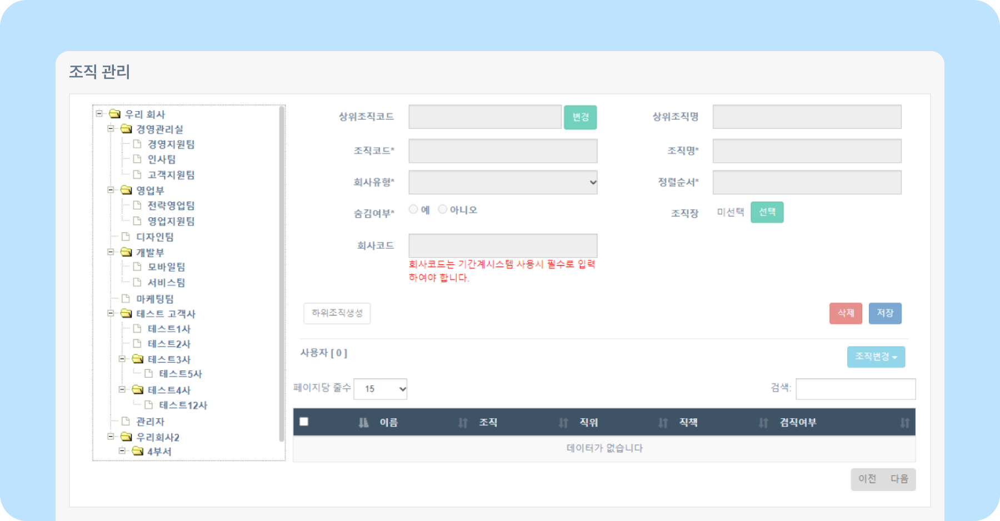

# 조직 관리 알아보기

## 조직 관리

- 뉴스피드 오른쪽 상단 **[설정 아이콘(⚙️)] - [관리자 메뉴] - 조직/사용자관리 - 조직 관리** 를 클릭하세요.
    
    - **상위조직코드** 상위조직코드 옆 **[변경]** 을 클릭해 상위조직을 바꿀 수 있습니다.
    - **상위조직명** 선택한 조직의 상위조직명을 확인할 수 있습니다.
    - **조직코드** 선택한 조직의 조직코드입니다. 숫자 변경 후 **[저장]** 버튼을 클릭하면 조직코드가 변경됩니다.
    - **조직명** 선택한 조직의 조직명입니다. 새로운 조직명을 입력하고 **[저장]** 버튼을 클릭하면 조직명이 변경됩니다.
    - **회사유형** 해당 조직의 유형을 바꿀 수 있습니다. 
    - **정렬순서** 조직도 내 정렬되는 순서를 지정할 수 있습니다.  
    - **숨김여부**
        - **예** 해당조직을 숨김니다. 조직도에서 조직이 보이지 않습니다.
        - **아니오** 해당조직을 숨기지 않습니다. 조직도에서 조직이 보입니다.
    - **조직장**  조직의 조직장을 선택할 수 있습니다. 조직장은 전자결재 승인 권한이 있습니다.
    - **회사코드** 회사코드입니다. 기간계시스템 사용 시에는 필수로 입력해야 합니다.

> 📢 조직을 생성할 때는 상위 조직을 먼저 클릭한 후 하위 조직을 생성해 주셔야 합니다.

> 📢 조직 생성 및 삭제, 변경에 관한 내용은 [조직 생성 및 삭제/사용자 조직 변경](../organization/set-organization.md) 페이지를 확인하세요.