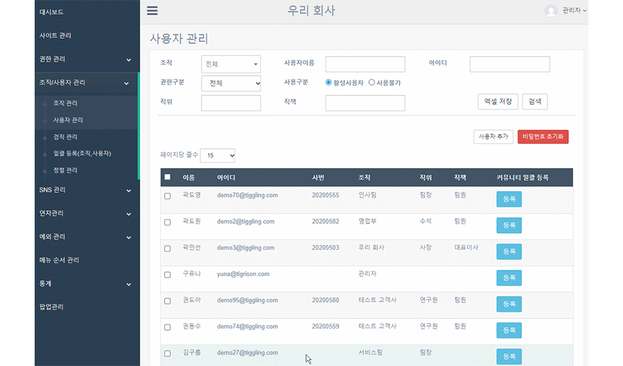

# 관리자 권한 부여하기

## 관리자 권한 부여하기
- 뉴스피드 오른쪽 상단 **[설정 아이콘(⚙️)] - [관리자메뉴] - 조직/사용자 관리 - 사용자 관리** 에서 관리자 권한을 부여할 수 있습니다.
- 사용자 목록에서 관리자 권한 부여를 희망하는 사용자를 클릭하면 설정 창이 띄워집니다.
- **권한그룹*** 에서 **사이트 관리자** 선택 후 **[저장]** 하세요.
- **한 사이트에 여러 명의 관리자를 등록할 수 있습니다.**
    