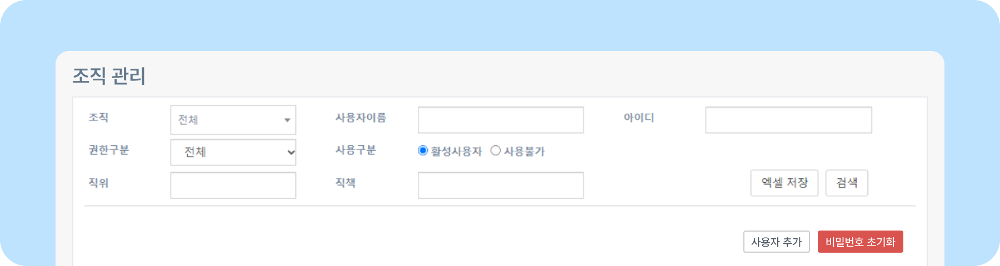
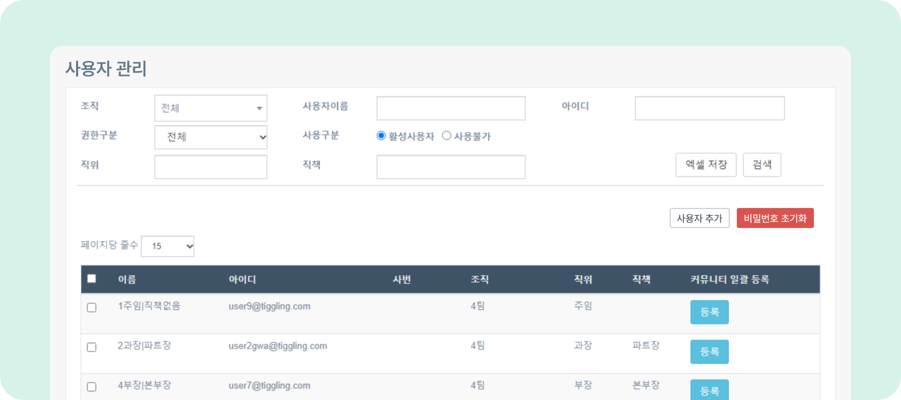
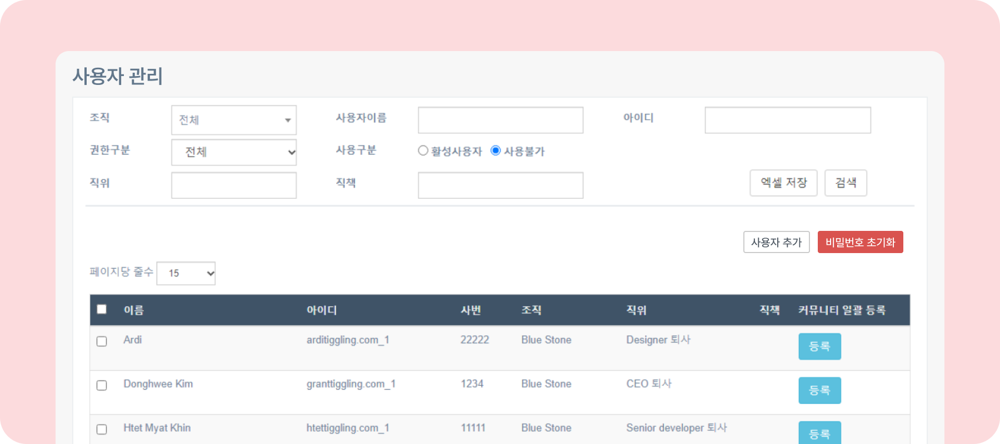

# 사용자 관리 알아보기

## 사용자 관리

- 뉴스피드 오른쪽 상단 **[설정 아이콘(⚙️)] - [관리자메뉴] - 조직/사용자관리 - 사용자 관리** 로 이동하세요. 조건에 따라 사용자를 **[검색]** 할 수 있습니다.
    
- **조직:** 사이트 내 조직이 나타납니다. 특정 조직의 사용자만 검색할 수 있습니다.
- **사용자이름:** 사용자 이름으로 검색할 수 있습니다.
- **아이디:** 사용자 아이디로 검색할 수 있습니다.
- **권한구분:** 사용자 유형별로 검색할 수 있습니다.
    - **내부사용자** 관리자 권한이 없는 일반 사이트 사용자입니다.
    - **대표이사** 사이트 대표이사를 설정할 수 있습니다. 대표이사에게는 관리자 권한이 없습니다.
    - **외부사용자** 외부사용자는 조직도에 포함되지 않아 조직도를 열람하는 것이 불가능하며, 커뮤니티 개설이 불가능합니다. 외부사용자는 전자결재와 드라이브 접근 권한이 없습니다.
    - **사이트관리자** 사이트관리자는 관리자메뉴에 접속해 사이트와 사용자를 관리할 수 있습니다.
- **사용구분**
    - **활성사용자** 사이트를 이용할 수 있는 사용자입니다.
        
          
    - **사용불가** 사이트를 이용할 수 없는 사용자입니다.
        
          
- **직위** 직위별 검색이 가능합니다. 직위에 관한 사항은 [직책 및 직위 정렬하기](./sort-position.md)를 참고하세요.
- **직책** 직책별 검색이 가능합니다. 직책에 관한 사항은 [직책 및 직위 정렬하기](./sort-position.md)를 참고하세요.