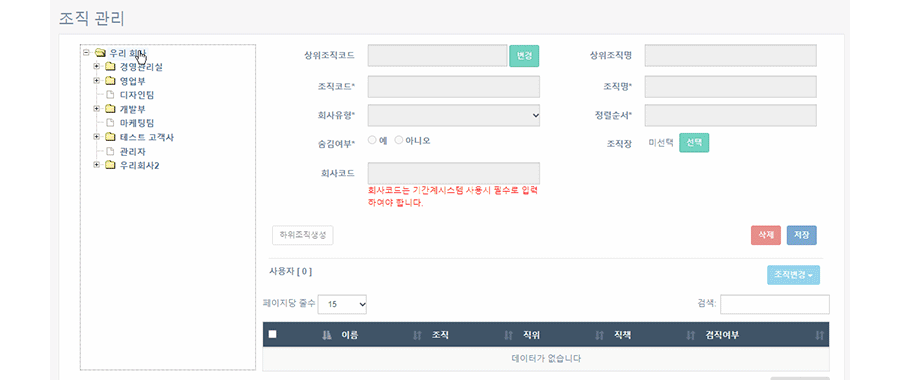
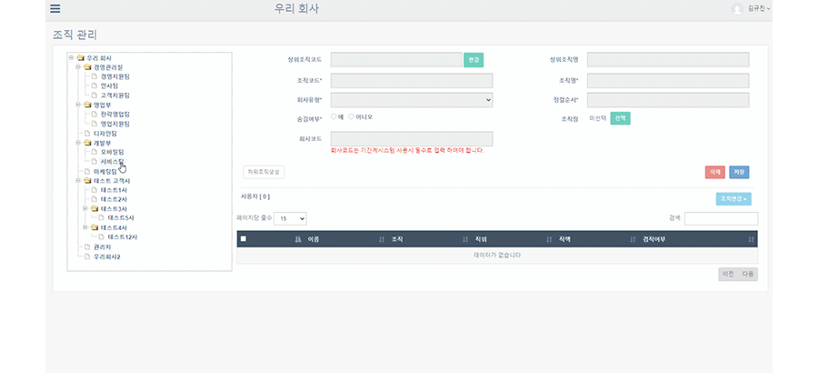
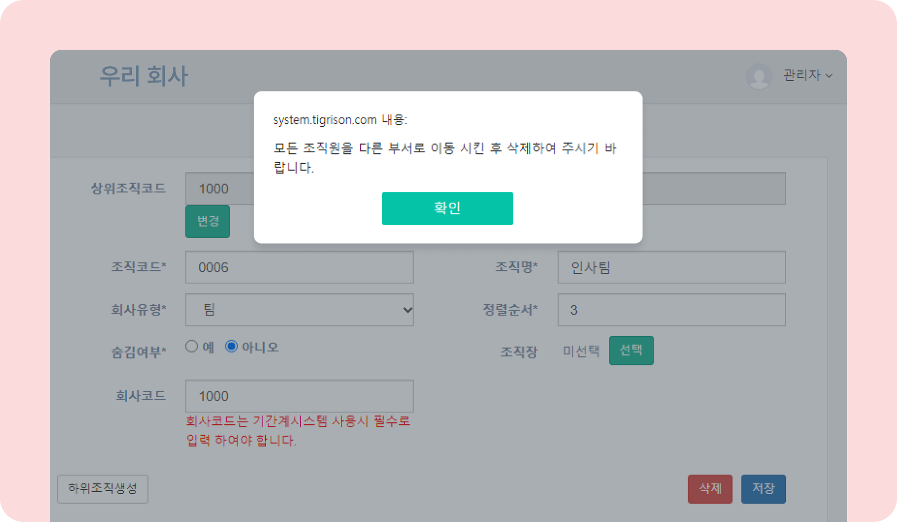
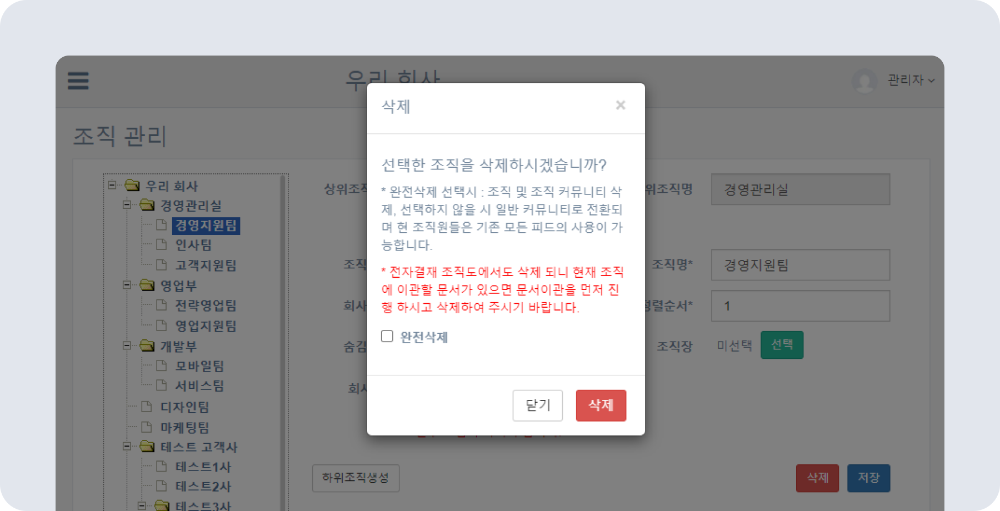

# 조직 생성 및 삭제/사용자 조직 변경

## 조직 생성/변경/삭제하기

- 조직은 생성 및 변경, 삭제할 수 있습니다.
- 조직 삭제 전 하위 조직이 없는지 확인하세요.
- 조직 삭제 시 조직 커뮤니티의 게시물과 자료, 전자결재 문서 등이 모두 삭제됩니다. **조직 삭제 전 필요한 게시물과 자료를 반드시 백업하세요.**
- 조직 관리에 관한 기본적인 설명은 [조직 관리 알아보기](./overview.md)를 참고하세요.

### 조직 생성하기

- 상위 조직 클릭 후 **[하위조직생성]** 버튼을 클릭하세요.
- **조직코드** 및 **조직명**을 입력한 후 **[저장]** 버튼을 클릭하세요.
    

### 사용자 조직 변경하기

- 조직 변경할 사용자를 선택한 후  **조직변경 - 이동 - 이동할 조직 선택 - 이동** 을 클릭하세요.
    

### 조직 삭제하기

- 삭제를 원하는 조직을 선택한 후 [**삭제]** 버튼을 클릭하세요.
- 조직에 포함된 사용자가 존재할 경우 조직을 삭제할 수 없습니다.
      
- **조직을 완전삭제할 경우 조직 커뮤니티 및 전자결재 문서들도 같이 삭제** 됩니다. 완전삭제 전 필요한 자료를 반드시 백업하세요.
- 완전삭제를 선택하지 않을 경우 일반 커뮤니티로 전환되며, 현 조직원들은 기존 모든 피드를 사용할 수 있습니다.
    