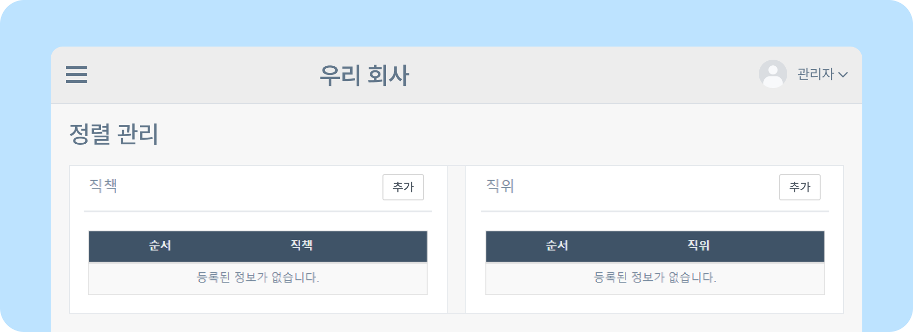
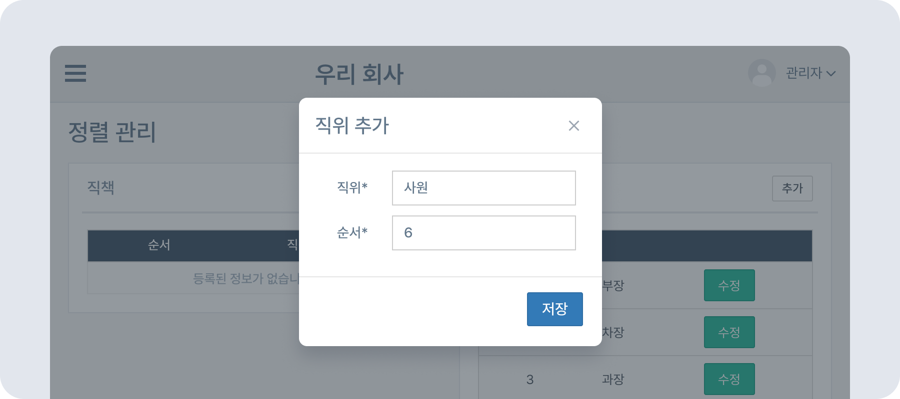

# 직책 및 직위 정렬하기

## 직책 및 직위 정렬하기

- 뉴스피드 오른쪽 상단 **[설정 아이콘(⚙️)] - [관리자메뉴] - 조직/사용자관리 - 정렬 관리** 로 이동하세요.
    

### 직책 정렬하기

- **직책** 오른쪽 **[추가]** 버튼 클릭 후 원하는 직책, 순서를 입력하고 저장합니다. 숫자가 작을수록 상위 정렬, 높은 직책입니다.
    

### 직위 정렬하기

- **직위** 오른쪽 **[추가]** 버튼 클릭 후 원하는 직위, 순서를 입력하고 저장합니다. 숫자가 작을수록 상위 정렬, 높은 직위입니다.
    