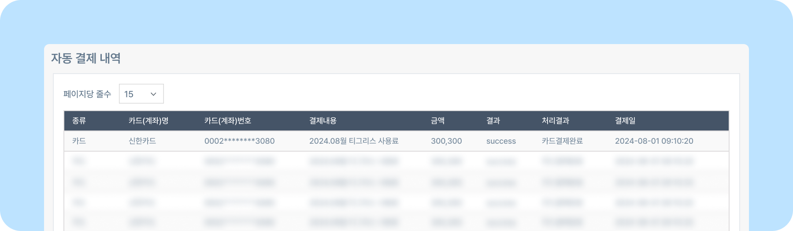

# 자동 결제 내역

## 자동 결제 내역 확인하는 방법

- 매 월 결제된 계좌 / 카드에 관한 **결제 내역을 확인** 할 수 있습니다.
    
- **종류:** 계좌나 카드의 종류를 확인 할 수 있습니다.
- **카드(계좌)명** **카드(계좌)번호:** 결제가 진행되는 정보를 확인 할 수 있습니다.
- **결제내용:** 결제 내역에 관한 내용을 확인할 수 있습니다.
- **금액:** 결제 금액에 대해 확인할 수 있습니다.
- **결과:** success - 성공 / error- 실패로 결제 결과를 확인 할 수 있습니다.
- **처리 결과:** 결제가 진행된 처리에 대한 결과를 확인할 수 있습니다.
- **결제일:** 결제가 진행된 날짜와 시간을 확인할 수 있습니다.