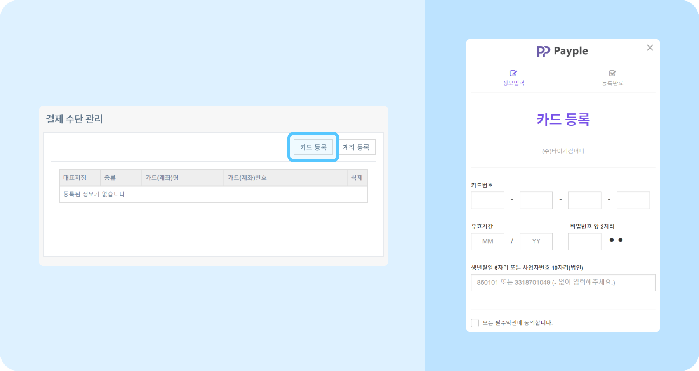
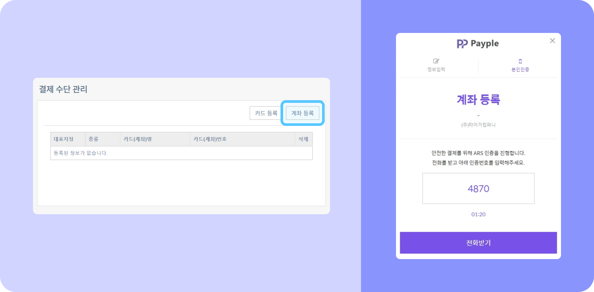

# 이용료 자동 결제 관리하기

## 카드로 자동 결제 등록하기

- **개인 또는 법인 신용카드로 자동 결제를 진행할 수 있습니다.**
- 뉴스피드 오른쪽 상단 **[설정 아이콘(⚙️)] - [관리자메뉴]** 를 클릭하세요.
- **[관리자메뉴]** 페이지에서 왼쪽 메뉴 하단 **결제 수단 관리**를 클릭하세요.
- **[카드 등록]** 버튼을 클릭하세요. 개인 또는 법인 신용카드 모두 등록 가능합니다.
- 카드 등록 창이 나타나면 필수 정보를 입력하고 **[등록하기]** 버튼을 클릭하세요.
- 카드 등록이 완료됩니다. 등록한 카드로 매월 사용료 납부가 진행됩니다.
    

## 계좌로 자동 결제 등록하기

- **개인 또는 법인 계좌 모두 등록할 수 있습니다.**
    

        
**왼쪽의 화살표를 클릭해** **자동이체 계좌 등록 가능한 은행 목록을 확인하세요.**

        

            NH농협은행  
            KB국민은행  
            신한은행  
            IBK기업은행  
            KEB하나은행  
            카카오뱅크  
            대구은행  
            부산은행  
            MG새마을금고  
            우체국  
            광주은행  
            경남은행  
            신협중앙회  
            수협  
            SC제일은행
        

    

- 뉴스피드 오른쪽 상단 **[설정 아이콘(⚙️)] - [관리자메뉴]** 를 클릭하세요.
- **[관리자메뉴]** 페이지에서 왼쪽 메뉴 하단 **결제 수단 관리**를 클릭하세요.
- **[계좌 등록]** 버튼을 클릭하세요. 개인 또는 법인 계좌 모두 등록 가능합니다.
- 계좌 등록 창이 나타나면 필수 정보를 입력하고 **[본인인증하기]** 버튼을 클릭하세요. ARS 인증이 진행됩니다. 전화를 받고 화면의 인증번호를 입력해주세요.
- 계좌 등록이 완료됩니다. 등록한 계좌로 매월 사용료 납부가 진행됩니다.
    

> 💡 **자동이체 계좌를 등록한 경우 세금계산서를 발행해 보내드립니다.** 세금계산서를 받을 메일 주소가 변경된 경우, 고객센터 문의하기를 통해 변경 요청해 주시기 바랍니다.

## 자동 결제 유의사항

- 결제일은 고객사별로 다릅니다. 결제한 날짜에 매월 자동 결제가 진행됩니다.
- 인원 추가 등으로 결제 금액이 달라지는 경우, 변경된 금액으로 자동 결제가 진행됩니다.

## 결제 수단 관리하기

- 뉴스피드 오른쪽 상단 **[설정 아이콘(⚙️)] - [관리자메뉴]  - 결제수단 관리**를 클릭하세요.
- 등록된 결제 수단 목록을 확인할 수 있습니다.
- 결제 수단 왼쪽 **[대표 지정]** 버튼을 클릭하면, 해당 결제 수단으로 사용료가 자동 결제됩니다.
    > 📌 대표 결제 수단으로 결제가 불가능한 경우, 등록된 다른 결제 수단으로 자동 결제가 진행됩니다.
- 결제 수단을 변경하고 싶은 경우, 변경할 결제 수단 왼쪽의 **[대표 지정]** 버튼을 클릭하세요.
- 결제 수단 오른쪽 **[삭제]** 버튼을 클릭하면 해당 결제 수단이 목록에서 삭제됩니다.

## 자동 결제 내역 확인하기

- 뉴스피드 오른쪽 상단 **[설정 아이콘(⚙️)] - [관리자메뉴]  - 자동 결제 내역**에서 결제 수단 및 금액, 결제일을 확인할 수 있습니다.