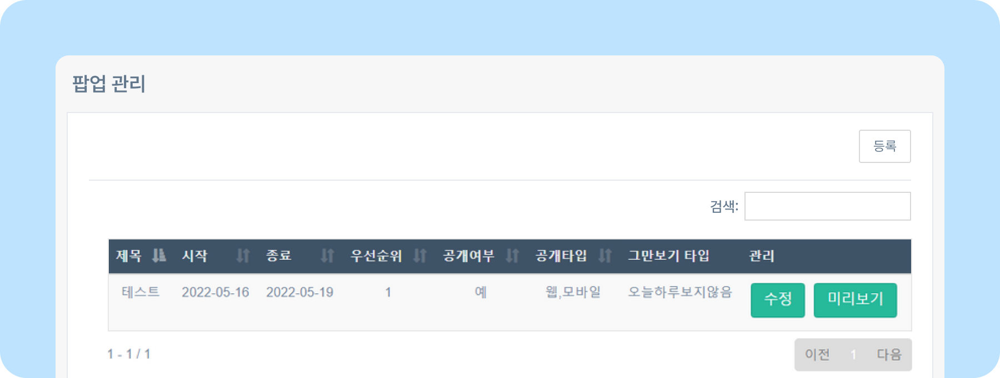
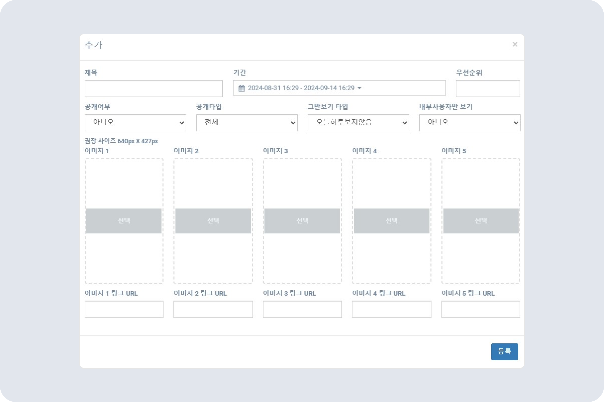

# 사이트에 팝업 등록하기

## 팝업 관리

- 중요한 사내 공지나 흥미로운 이벤트는 팝업 기능을 활용할 수 있습니다.
- 뉴스피드 오른쪽 상단 **[설정 아이콘(⚙️)] - [관리자 메뉴] - 팝업관리**를 클릭하세요.
    
- 팝업 내용을 작성한 후 **[등록]** 버튼을 클릭하세요.
    
    > 💡 팝업은 최대 5개까지 가능합니다.
    
    - **기간** 팝업이 노출될 기간을 설정하세요.
    - **우선순위** 팝업을 여러 개 등록할 경우 순서를 정할 수 있습니다. 우선순위 숫자가 낮을수록 먼저 노출됩니다.
    - **공개 타입** 웹, 모바일 팝업 설정이 가능합니다. 전체 선택 시 웹과 모바일에서 모두 팝업이 노출됩니다.
    - **그만보기 타입** 오늘 하루, 다시 보지 않기 등 타입을 설정할 수 있습니다.
    - **내부사용자만 보기** 외부 사용자들은 볼 수 없도록 설정할 수 있습니다.
    - **이미지** 이미지 권장 사이즈는 640x427px입니다. 연결할 외부 URL 주소를 입력하세요.
    
