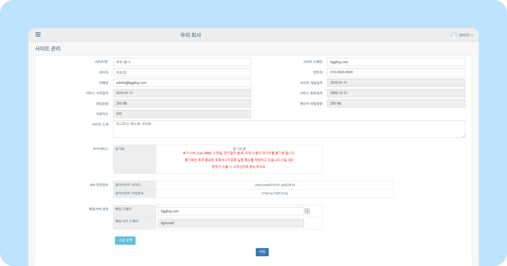
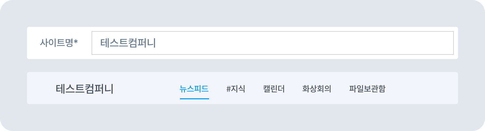
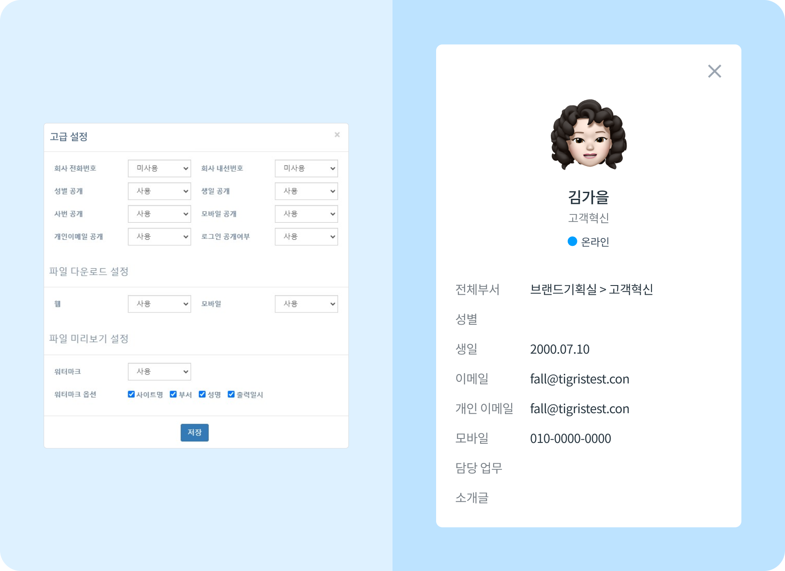
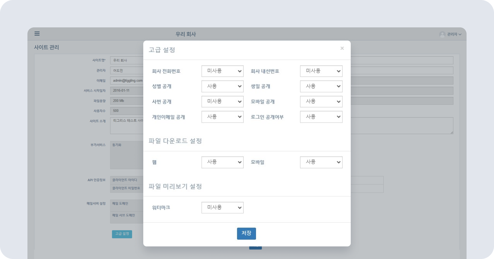

# 사이트 정보 변경/설정하기

## 사이트 관리하기

- 회사의 상세 정보를 확인하고 수정할 수 있습니다.
- 사이트 관리자 변동 시 관리자 정보를 수정할 수 있습니다.
- 사용자 정보에 관한 고급 설정과 파일 다운로드 설정을 변경할 수 있습니다.

> 💡 회색으로 표시된 영역은 수정할 수 없습니다.

- **사이트명** 티그리스 메인화면 왼쪽 상단에 노출되는 회사의 사이트명입니다. 
- 사이트 관리 페이지 사이트명*에 새로운 이름을 입력한 후 **[저장]** 버튼을 누르면 사이트명이 변경됩니다.
    
- **사이트 도메인** 이메일 도메인과 일치합니다.
- **관리자** 사이트 관리자의 이름이 노출됩니다.
- **연락처** 사이트 관리자의 연락처 정보를 확인할 수 있습니다.
- **이메일** 사이트 관리자의 이메일 주소를 입력하세요.
    - 사이트 관리자가 바뀔 경우, 관**리자 연락처 이메일** 정보를 수정하세요.
- **사이트 소개** 회사 사이트에 관한 소개글을 작성할 수 있습니다.
- **부가서비스** 티그리스에서 사용 중인 부가서비스 목록을 확인할 수 있습니다.
    - 사용 중인 부가서비스 옆 **[동기화 (🔄)]** 아이콘을 클릭하면,  
    HRM, 이메일, 전자결재의 사용자 및 조직 정보 동기화 작업이 진행됩니다.  
    동기화는 매주 중요한 프로세스이므로 **1일 1회**로 횟수 제한하고 있습니다.
- **API 인증정보**
- **메일서버 설정**

## 고급 설정

- **고급 설정**에서 퀵다이얼에 노출되는 사용자 정보 목록을 관리할 수 있습니다.
    - 퀵다이얼에 관한 정보는 [다른 사용자 프로필 확인하기](#) 에서 확인할 수 있습니다.

- **고급 설정**에서 사용으로 선택한 정보는 프로필에 노출됩니다.
- **고급 설정**에서 미사용으로 선택한 정보는 프로필에 노출되지 않습니다.
- **파일 다운로드 설정**에서 웹과 모바일 첨부파일 다운로드 기능을 각각 제한할 수 있습니다. 
    
    - **사용** 선택 시 업로드한 파일의 미리보기와 다운로드가 가능합니다.
    - **미사용** 선택 시 업로드한 파일 미리보기만 가능합니다. 메신저, 저장소 등 티그리스 내에서 모든 파일 다운로드가 불가능합니다.
- **파일 미리보기 설정**에서 미리보기 파일의 워터마크 사용 여부를 설정할 수 있습니다.