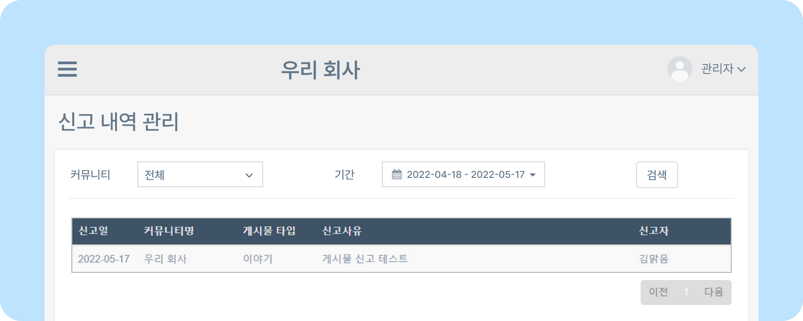
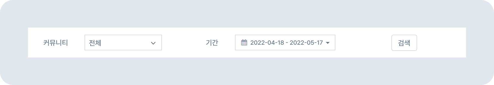
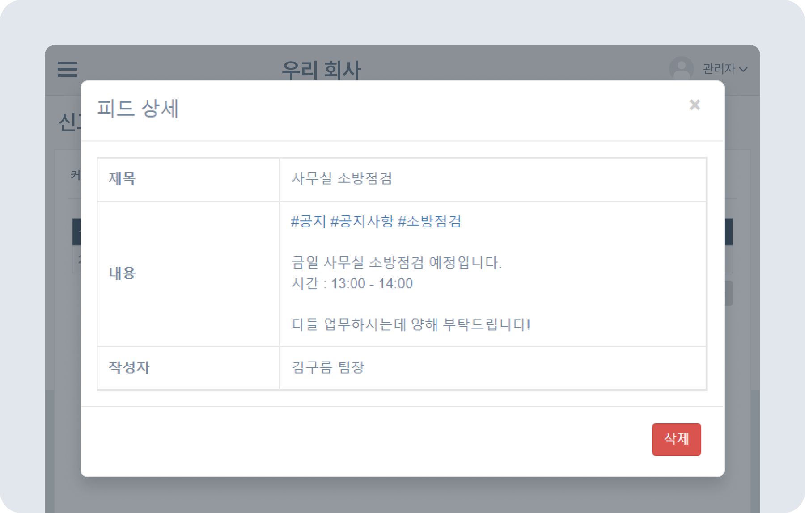

# 신고된 게시물 확인/삭제하기

## 신고 내역 관리

- 관리자는 신고된 게시물을 확인할 수 있습니다. 게시물 신고 내역을 확인하여 조직과 커뮤니티 업무 환경을 더욱 쾌적하게 관리하세요.

### 신고 내역 확인하기

- 뉴스피드 오른쪽 상단 **[설정 아이콘(⚙️)] - [관리자 메뉴] - SNS 관리 - 신고 내역 관리** 로 이동하세요.
    
- 신고된 게시물은  **커뮤니티** 및 **기간** 별로 검색할 수 있습니다.
    
- 신고된 게시물을 클릭하면 제목 및 내용 작성자를 확인할 수 있는 **피드 상세** 창이 나타납니다.
- 신고된 게시물의 **피드 상세** 창 하단 **[삭제]** 버튼을 클릭하면 게시글이 삭제됩니다.
    

> 🚨 게시글을 신고하는 방법은 [게시물 즐겨찾기/신고하기](#)를 참고하세요.