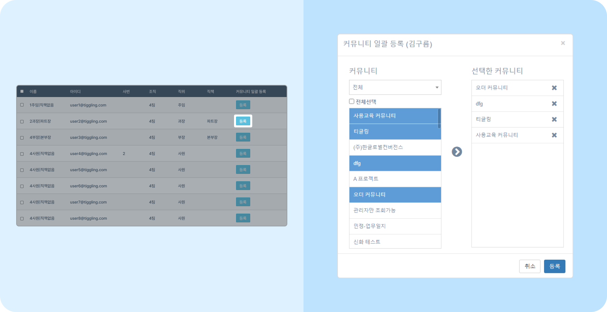

# 커뮤니티 관리하기

## 커뮤니티 관리

- 뉴스피드 오른쪽 상단 **[설정 아이콘(⚙️)] - [관리자메뉴] - SNS 관리 - 커뮤니티 관리** 에서 모든 커뮤니티 정보를 확인하고 관리할 수 있습니다.
- **✅ 필수 커뮤니티 사용** 에  체크하면 사용자가 사이트에 가입할 때 자동으로 해당 커뮤니티에 가입됩니다.
    > 📌 공지 커뮤니티는 필수 커뮤니티로 설정하세요. 자동으로 가입되어 편리합니다.
- 관리자는 커뮤니티 운영자 및 개설자 변경이 가능하며, 운영자가 아니어도 회원 초대 및 탈퇴를 진행할 수 있습니다.
    
    > 💻 커뮤니티 개설자가 퇴사자일 경우 관리자가 개설자를 변경할 수 있습니다.

## 커뮤니티 일괄 등록

- 구성원들이 공통적으로 확인해야 하는 커뮤니티가 있다면, 커뮤니티 구성원을 일괄적으로 등록할 수 있습니다.
- 뉴스피드 오른쪽 상단 **[설정 아이콘(⚙️)] - [관리자메뉴] - 조직/사용자 관리 - 사용자 관리** 로 접속합니다.
- 커뮤니티 등록을 원하는 사용자의 **커뮤니티 일괄 등록 - [등록]** - 원하는 **커뮤니티** 를 모두 추가 - **[등록]** 하세요.
    

## 폐쇄한 커뮤니티 복구(사용 처리)

- 뉴스피드 오른쪽 상단 **[설정 아이콘(⚙️)] - [관리자메뉴] - SNS 관리 - 커뮤니티 관리** 를 조회하세요.
- 상단 검색 필터에서 **삭제여부 - Y** 선택 후 **[검색]** 을 클릭하세요.
    
- 복구할 커뮤니티를 선택한 후 커뮤니티 정보 오른쪽 하단 **사용** 버튼을 클릭하세요.
- 안내 팝업이 뜨면 **확인**을 클릭해 주세요. 커뮤니티 멤버는 초기화됩니다.
    
- 초기화된 멤버를 다시 초대하세요. 커뮤니티 관리에서 사용 처리한 커뮤니티를 클릭한 후 왼쪽 하단 **회원초대** 를 클릭하세요.
- 조직도에서 회원을 초대할 수 있습니다. 초대할 사용자를 추가한 후 **[저장]** 버튼을 클릭하세요.
    