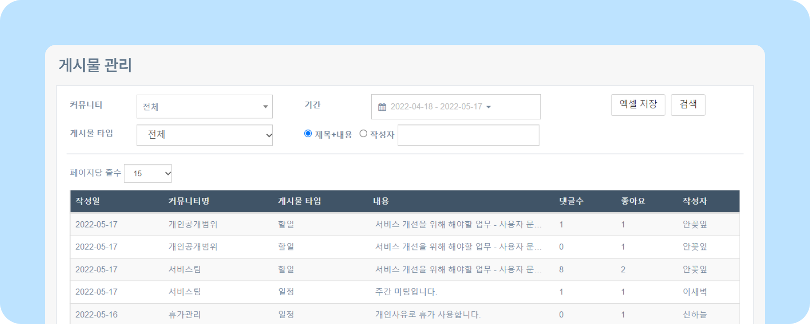
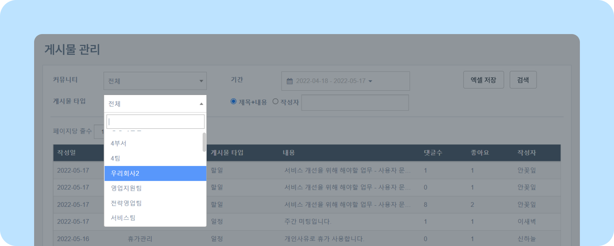
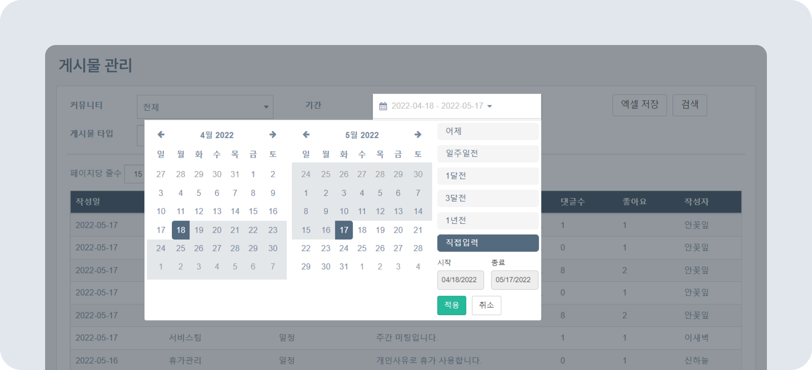
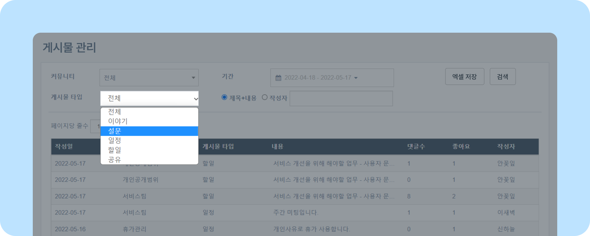
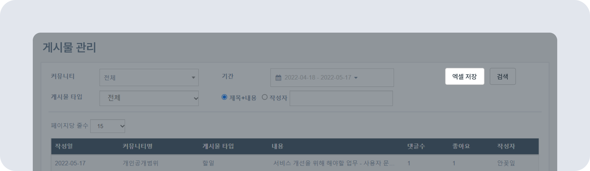
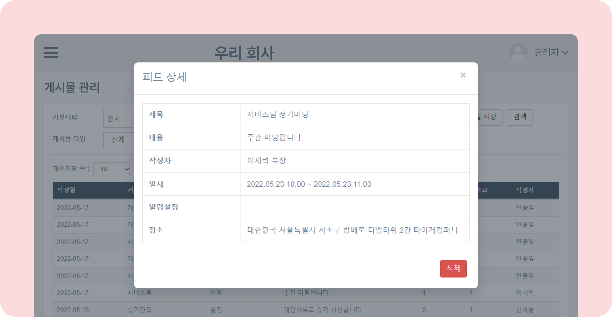
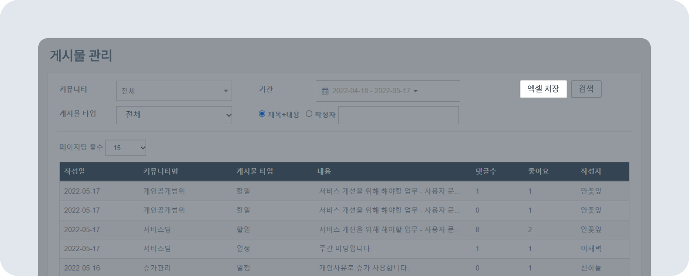

# 게시물 확인/삭제/저장하기

## 게시물 관리하기

- 사이트에 작성된 게시물을 확인하고, 삭제할 수 있습니다.

### 게시물 관리 알아보기

- 뉴스피드 오른쪽 상단 **[설정 아이콘(⚙️)] - [관리자메뉴] - SNS 관리 - 커뮤니티 관리** 에서 작성된 모든 게시물을 확인할 수 있습니다.
    
    > ✏️ 원하는 게시물을 클릭하면 상세 내용을 볼 수 있습니다. 첨부된 파일도 함께 확인 가능합니다.

### 게시물 확인하기

- **커뮤니티** 를 지정하고 **[검색]** 하면 커뮤니티별 게시글을 확인할 수 있습니다.
    
- **기간** 항목을 통해 특정 기간에 작성된 게시물만 **검색** 할 수 있습니다.
    
- **게시물 타입** 항목을 통해 글 작성 유형(전체/이야기/설문/일정/할일/공유)에 따라 게시물을 확인할 수 있습니다.
    
- **제목+내용** 키워드 또는 **작성자 이름** 으로 게시물을 검색할 수 있습니다.
    

### 게시물 삭제하기

- 게시물을 클릭하면 해당 게시물의 **피드 상세** 내용을 확인할 수 있습니다.
- **피드 상세** 하단의 **[삭제]** 버튼을 클릭하면 게시물이 삭제됩니다.
    

### 게시물 엑셀 파일로 저장하기

- **[엑셀 저장]** 버튼을 통해 게시물을 엑셀 파일로 다운로드할 수 있습니다.
    