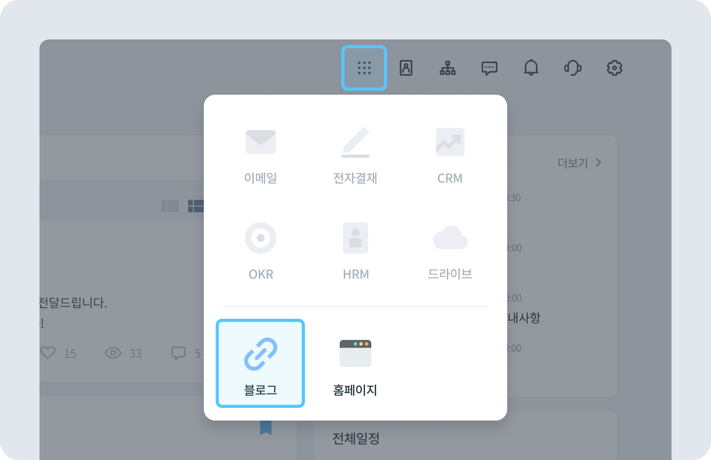
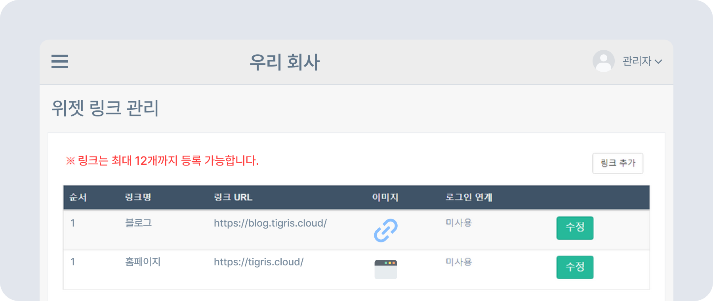
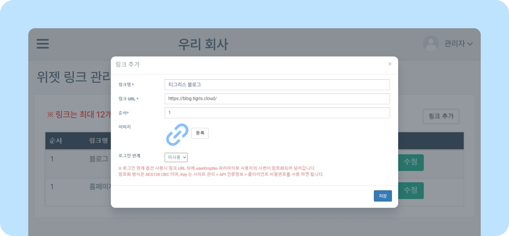
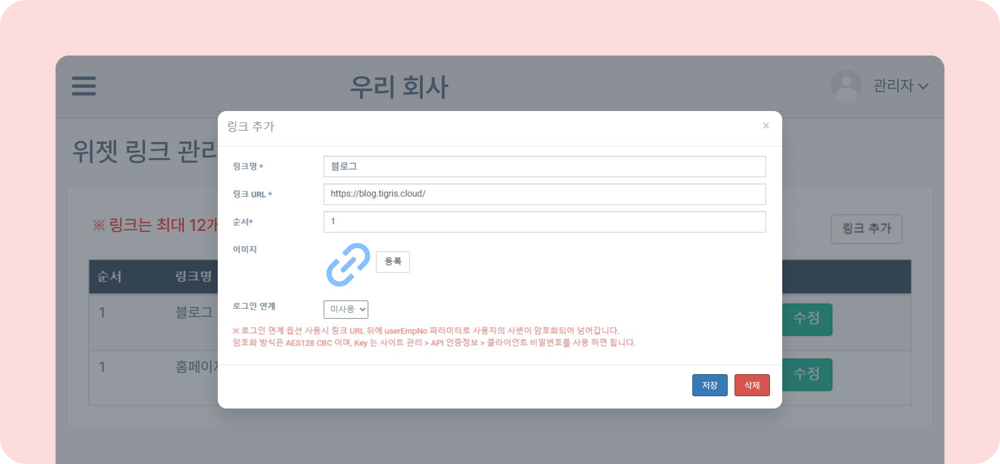

# 위젯 링크 관리하기

## 위젯 링크 관리

- 위젯 링크를 설정하면 티그리스 메인화면 오른쪽 상단 **앱 서랍** 에서 확인할 수 있습니다.
    
- 위젯 링크는 최대 12개까지 등록할 수 있습니다.

### 위젯 링크 등록하기

- 뉴스피드 오른쪽 상단 **[설정 아이콘(⚙️)] - [관리자 메뉴] - SNS 관리 - 위젯 링크 관리** 를 클릭하세요.
    
- 위젯 링크 추가를 위해 **[링크 추가]** 버튼을 클릭해 주세요.
- 링크명과 링크 URL, 앱 서랍에 노출될 순서, 이미지를 추가하세요.
    > 📎 링크 URL은 https://aaa.aaa 와 같은 형식으로 작성해야 합니다.
- 로그인 연계 옵션을 사용할 수 있습니다.
    

### 위젯 링크 수정/삭제하기

- **위젯 링크 관리** 페이지에서 위젯 링크를 수정하거나 삭제할 수 있습니다.
- 링크 오른쪽 **[수정]** 버튼을 클릭한 후 링크명, 링크 URL, 순서, 이미지를 수정한 후 **[저장]** 버튼을 클릭하면 위젯 링크가 변경됩니다.
- 링크 오른쪽 **[수정]** 버튼을 클릭한 후 하단의 **[삭제]** 버튼을 클릭하면 위젯 링크가 삭제됩니다.
    