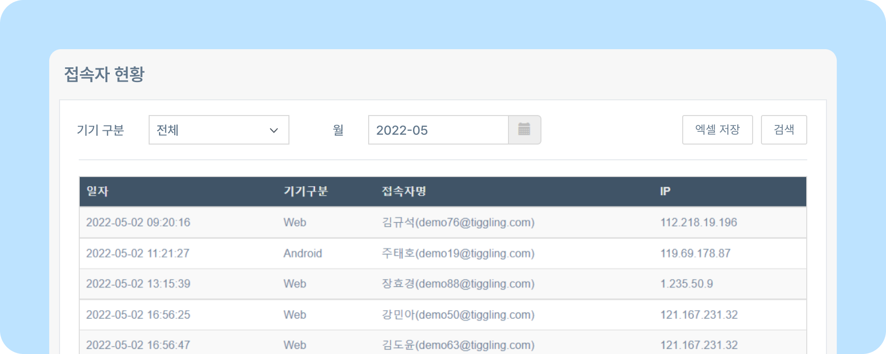
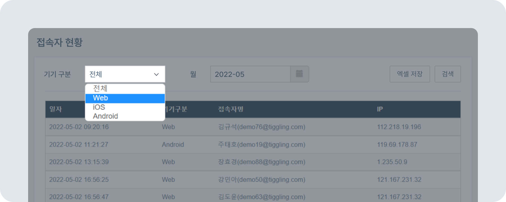
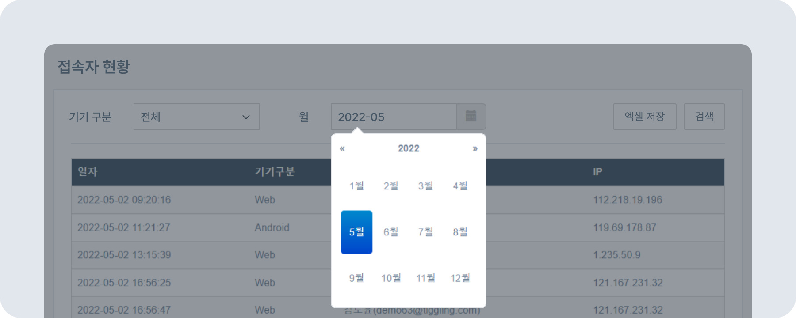
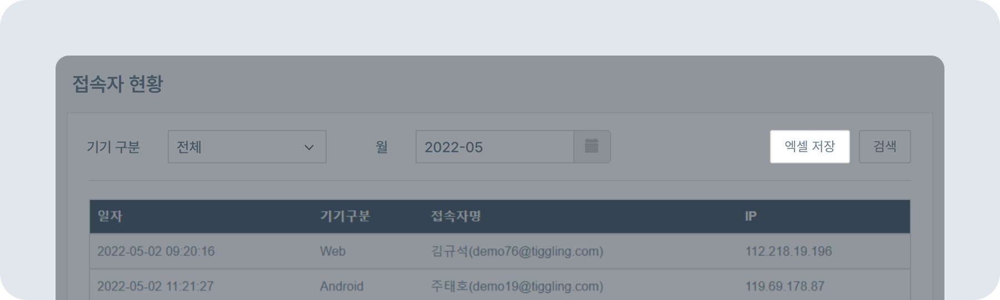

# 접속자 현황

## 접속자 현황 확인하기

- 뉴스피드 오른쪽 상단 **[설정 아이콘(⚙️)] - [관리자메뉴] - 통계 - 접속자 현황**을 클릭하세요.
    
- **기기구분**에서 전체/Web/iOS/Android 선택 후 **[검색]** 하면 기기별 접속자 현황을 확인할 수 있습니다.
    
- **월** 옆 달력 아이콘을 클릭해 확인할 월을 선택한 후 **[검색]** 하면 월별 접속자 현황을 확인할 수 있습니다.
    
- **[엑셀저장]** 클릭 시 통해 접속자 현황 정보를 엑셀 파일로 저장할 수 있습니다.
    