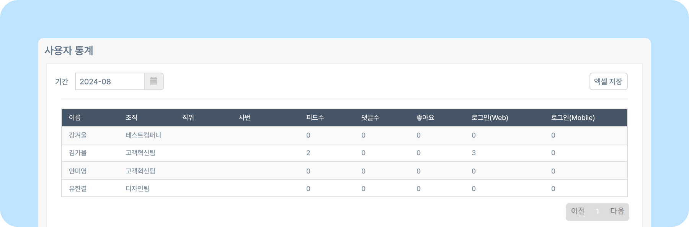

# 사용자 통계

## 사용자 통계
- 뉴스피드 오른쪽 상단 **[설정 아이콘(⚙️)] - [관리자메뉴] - 통계 - 사용자 통계** 를 클릭하세요.
    
- **기간** 옆 달력 아이콘 클릭 시 月별로 사용자 통계 및 정보(피드수, 댓글수, 좋아요 등)를 확인할 수 있습니다.
- **[엑셀저장]** 버튼을 클릭하면 사용자 통계 정보를 엑셀 파일로 저장할 수 있습니다.